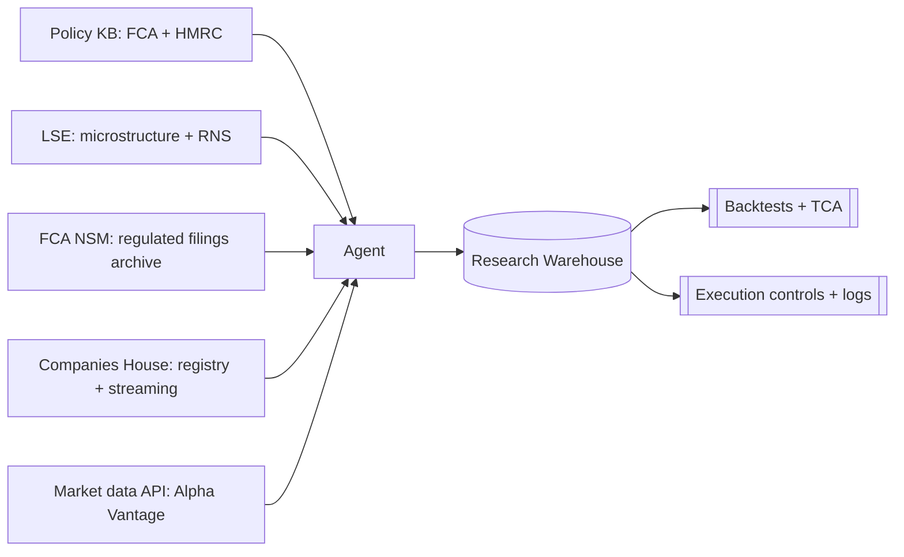

# Data Pipelines And API Calls

## Data Flow



## Daily Operating Timeline

```mermaid
timeline
  title UK equity trading research cadence
  06:30 : Refresh models and risk limits; check rule and tax changes
  07:00 : Sync Companies House deltas; pull NSM exports if needed
  07:30 : Review public announcements for watchlist events
  08:00 : Market open; simulate or execute with monitoring and kill-switch readiness
  12:00 : Midday review; check slippage and drift
  16:30 : Closing auction and close process
  17:00 : Post-trade reconcile; TCA; incident log
  18:00 : Research notes; prepare next day
```

## Companies House API Examples

### cURL: Company Profile

```bash
curl -u "$CH_KEY:" "https://api.company-information.service.gov.uk/company/00000006"
```

### cURL: Search Companies

```bash
curl -u "$CH_KEY:" "https://api.company-information.service.gov.uk/search/companies?q=TESCO"
```

### Python: Company Profile

```python
import os
import requests
from requests.auth import HTTPBasicAuth

CH_KEY = os.environ["CH_KEY"]
url = "https://api.company-information.service.gov.uk/company/00000006"

r = requests.get(url, auth=HTTPBasicAuth(CH_KEY, ""))
r.raise_for_status()
data = r.json()
print(data["company_name"], data["company_status"])
```

### Python: Retry On 429

```python
import time
import requests
from requests.auth import HTTPBasicAuth

def get_with_retry(url: str, key: str, max_tries: int = 8):
    for attempt in range(max_tries):
        r = requests.get(url, auth=HTTPBasicAuth(key, ""))
        if r.status_code == 429:
            time.sleep(2 ** attempt)
            continue
        r.raise_for_status()
        return r.json()
    raise RuntimeError("Rate limit persists; stop and resume later.")
```

## Alpha Vantage Examples

### cURL: Daily Time Series

```bash
curl "https://www.alphavantage.co/query?function=TIME_SERIES_DAILY&symbol=TSCO.LON&outputsize=full&apikey=$AV_KEY"
```

### Python: Parse Daily Time Series

```python
import os
import requests
import pandas as pd

AV_KEY = os.environ["AV_KEY"]
url = "https://www.alphavantage.co/query"
params = {
    "function": "TIME_SERIES_DAILY",
    "symbol": "TSCO.LON",
    "outputsize": "full",
    "apikey": AV_KEY,
}
r = requests.get(url, params=params, timeout=30)
r.raise_for_status()
payload = r.json()

ts = payload.get("Time Series (Daily)", {})
df = (
    pd.DataFrame.from_dict(ts, orient="index")
    .rename(
        columns={
            "1. open": "open",
            "2. high": "high",
            "3. low": "low",
            "4. close": "close",
            "5. volume": "volume",
        }
    )
    .astype(float)
)
df.index = pd.to_datetime(df.index)
df = df.sort_index()
print(df.tail())
```

## Engineering Guardrails

- Store raw responses with ingestion timestamps.
- Maintain a versioned instrument master.
- Validate corporate-action assumptions before backtesting.
- Respect rate limits and licensing terms.

## Source-Derived Constraints

- Companies House uses HTTP Basic authentication with the API key as the username and a blank password.
- Companies House rate limiting is 600 requests per five-minute period, with `429 Too Many Requests` on breach.
- Companies House data is public-record data and should not be treated as verified truth without cross-checking.
- FCA NSM is an archive and is generally available within about an hour of submission, so it should not sit on the critical path for real-time signal generation.
- Alpha Vantage free usage is limited to 25 requests per day.
- Alpha Vantage daily and intraday adjusted series apply split and dividend adjustments, which affects feature engineering and backtest comparability.

## Architecture Implication

The ingestion layer should separate:

- reference and issuer data,
- historical market data,
- event and disclosure data,
- derived features.

That separation keeps the backtest engine deterministic and lets us swap data vendors later without rewriting strategy code.
