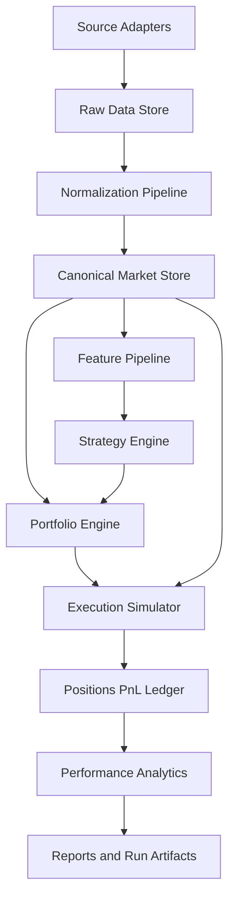

# Backtesting System Architecture

## Target System

The first system should be a deterministic offline research and backtesting engine.

It should answer one question reliably:

Can a simple strategy be tested on UK equity historical data with realistic enough portfolio, cost, and reporting logic to support iteration?

## Top-Level Components

## Component Responsibilities

### Source Adapters

- Download historical market data
- Download issuer metadata
- Download disclosure and filing context where relevant
- Store raw payloads with source name and timestamp

### Normalization Pipeline

- Convert vendor fields into internal schemas
- Normalize symbols, dates, currencies, and corporate-action handling
- Reject malformed or incomplete records early

### Canonical Market Store

- Bars by instrument and date
- Corporate actions
- Instrument master and identifier mappings
- Trading calendar

### Feature Pipeline

- Compute indicators and ranking factors from canonical data
- Materialize reusable features so backtests are reproducible

### Strategy Engine

- Consume feature snapshots
- Emit target weights, target positions, or orders
- Remain pure and deterministic

### Portfolio Engine

- Convert signals into position targets
- Enforce cash, exposure, concentration, and rebalance rules

### Execution Simulator

- Translate targets into simulated fills
- Apply fill timing assumptions
- Apply commissions, slippage, spread penalty, and UK tax assumptions where applicable

### Ledger And Analytics

- Track trades, holdings, cash, fees, tax assumptions, and P&L
- Produce equity curve, drawdown, turnover, exposure, and attribution outputs

## First-Pass Simplifications

- Bar frequency: daily only
- Fill timing: next bar open or same bar close, chosen explicitly per strategy
- Liquidity model: simple ADV participation cap
- Slippage model: fixed basis points plus half-spread estimate
- Universe size: small curated UK equity universe first

## Minimum Artifacts Per Backtest Run

- run config
- input dataset versions
- strategy parameters
- orders and fills
- daily positions
- daily portfolio NAV
- metrics report

## Critical Architectural Decision

The backtest should produce the same result every time when given the same inputs and config. If that is not true, the system is not yet usable as an engineering tool.
