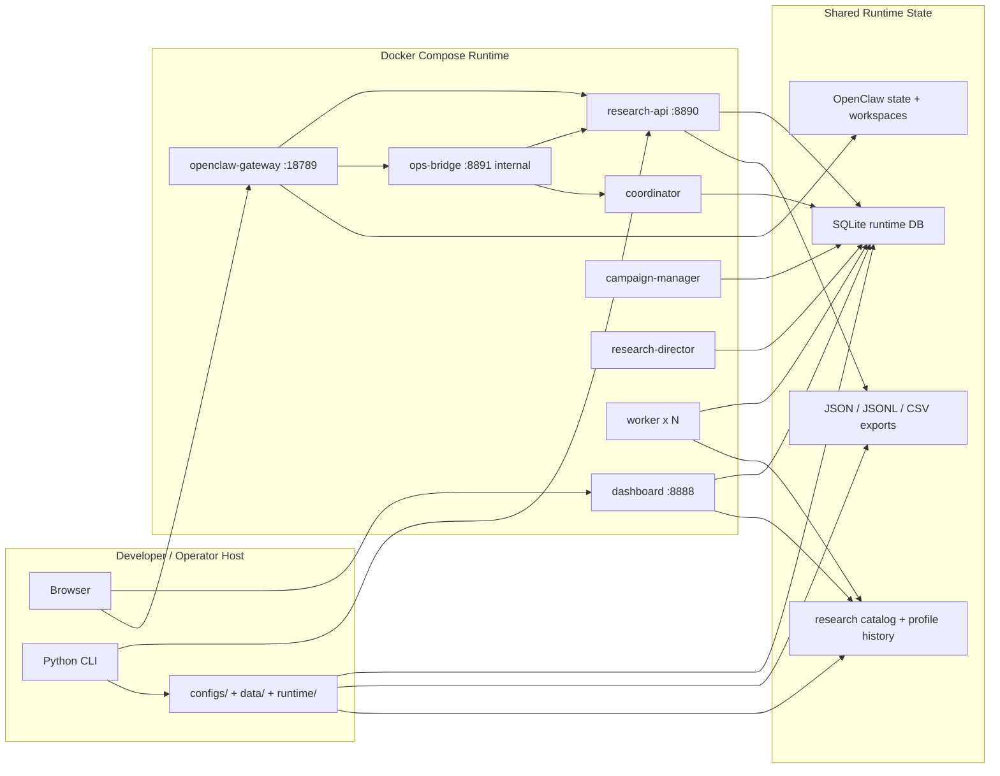
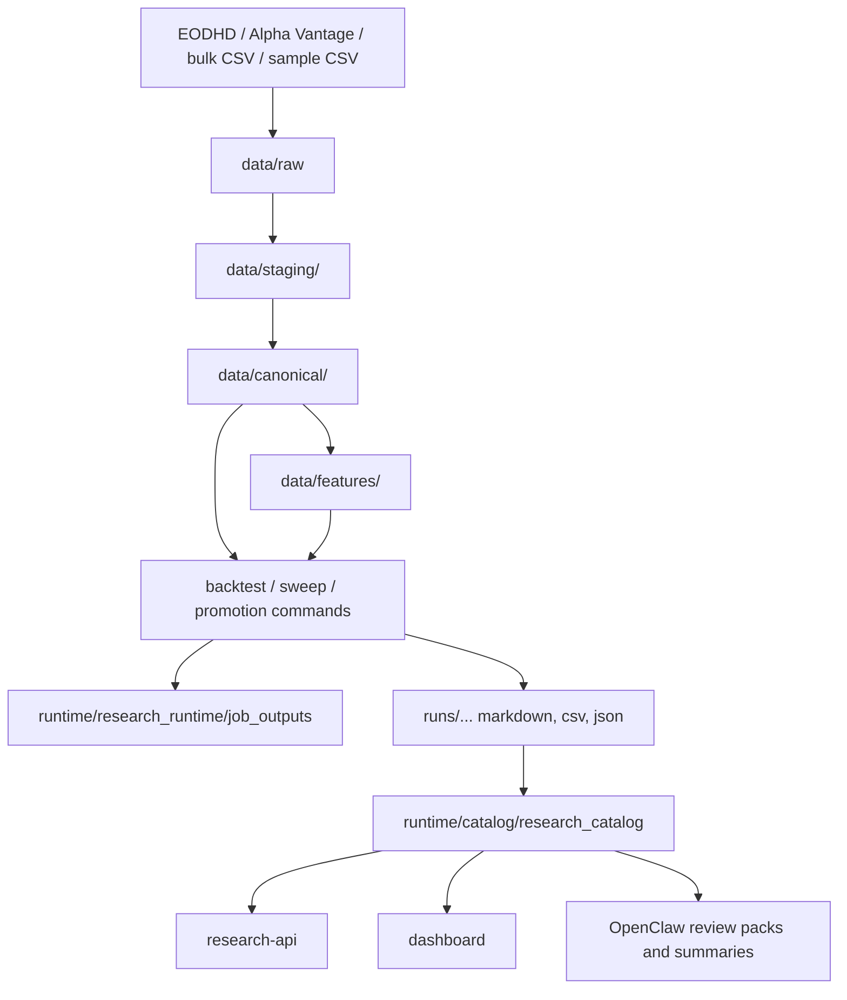
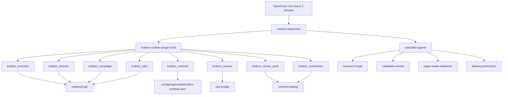

# Tech Stack And Runtime Brief

## Purpose

This document summarizes the current Trotters stack as it exists in the repository on March 23, 2026.

It is written as a handoff brief for a deep research tool or external reviewer that needs to answer:

- what this system is today
- how the runtime is assembled
- how OpenClaw is being used
- where the main architectural leverage points and bottlenecks are
- what strategic next-step questions are worth researching

This is a current-state document, not a future-state wishlist.

## Executive Summary

Trotters is currently a Python 3.11 research platform for UK equity strategy development, backtesting, campaign orchestration, operator review, and paper-trading preparation.

The core product is not live trading. It is an offline and semi-autonomous research runtime with these major layers:

- a deterministic research and backtesting engine in Python
- a SQLite-backed runtime orchestration layer for campaigns, directors, workers, notifications, and artifacts
- a local operator surface made of a dashboard, a token-protected runtime API, and a narrow internal ops bridge
- an OpenClaw gateway that acts as an AI control plane over the runtime through a custom repo-managed plugin

The runtime is containerized with Docker Compose. Compose is not just a packaging choice here; it is the operating model. The research services, OpenClaw gateway, shared runtime volume, and Docker-socket-backed ops bridge are all coupled through the Compose topology.

As of March 23, 2026, live container state could not be verified from this workspace because `docker compose ps` could not connect to the local Docker engine. The container inventory below therefore reflects configured Compose services rather than confirmed running containers.

## Scope And Current Boundaries

Current intended scope:

- UK equity research
- daily-bar historical data
- offline backtesting and comparison workflows
- autonomous campaign progression inside bounded rules
- candidate review and paper-trade readiness preparation

Explicit non-goals right now:

- live broker connectivity
- autonomous order placement
- intraday execution or market-making
- broad unconstrained AI agent autonomy

## Current Stack

| Layer | Current technology | How it is being used |
| --- | --- | --- |
| Core language | Python 3.11 | Main application, CLI, runtime services, backtesting engine, API, dashboard, ops bridge, orchestration logic |
| Packaging | `setuptools`, editable install from `pyproject.toml` | Very light Python packaging; the project currently declares no third-party Python dependencies in `pyproject.toml` |
| Secondary language | JavaScript / Node.js | Custom OpenClaw plugin under `extensions/openclaw/trotters-runtime` |
| Runtime orchestration | Docker Compose | Runs the research runtime, dashboard, API, ops bridge, OpenClaw gateway, and scaled worker pool |
| State store | SQLite | Runtime database at `runtime/research_runtime/state/research_runtime.sqlite3` using WAL mode |
| APIs / servers | stdlib WSGI via `wsgiref.simple_server` | `research-api`, `research-dashboard`, and `research-ops-bridge` are simple in-process HTTP services, not FastAPI/Flask services |
| Data storage | CSV, JSON, JSONL, Markdown | Raw/staging/canonical market data, runtime exports, campaign notifications, reports, promotion artifacts, operator summaries |
| Research inputs | EODHD, Alpha Vantage, bulk CSV, sample CSV | EODHD is the main serious research path; Alpha Vantage and sample data remain supporting paths |
| Agent control plane | OpenClaw gateway plus custom plugin | Runs a conservative runtime supervisor and specialist review agents against the internal Trotters control surfaces |
| UI | Server-rendered HTML dashboard | Local authenticated operator console on port `8888` |
| Testing | `unittest` plus Docker test image | Isolated test runner uses `Dockerfile.test`; Node.js is installed there to support OpenClaw integration coverage |

## System Architecture

### 1. High-Level Runtime Topology

### 2. Research Data And Artifact Flow

### 3. OpenClaw Control Plane

## Core Application Design

The repo has two closely related but distinct halves.

### Backtesting And Research Engine

This is the deterministic strategy and experiment layer.

Major responsibilities:

- stage raw vendor data into normalized intermediate datasets
- materialize canonical daily-bar datasets
- materialize reusable feature sets
- run backtests and comparison workflows
- write reports, promotion artifacts, and catalog entries

Representative commands:

- `stage`
- `ingest`
- `materialize-features`
- `backtest`
- `compare-strategies`
- `validate-split`
- `walk-forward`
- `promotion-check`
- `operability-program`
- `paper-trade-decision`

### Runtime Orchestration Layer

This is the semi-autonomous operating system around the research engine.

Major responsibilities:

- queue and lease research jobs
- manage campaign state machines
- manage director state machines
- run distributed workers
- emit notifications and service heartbeats
- export runtime status and machine-readable catalogs

Important runtime characteristics:

- runtime state is persisted under `runtime/research_runtime`
- orchestration state is stored in SQLite
- workers run bounded research commands, not arbitrary shell access
- campaigns progress through defined phases rather than free-form agent planning
- directors can chain approved campaigns until a candidate is frozen or the queue is exhausted

## Docker And Container Usage

### Compose Files

- `docker-compose.yml`: main research runtime stack
- `docker-compose.test.yml`: isolated test runner stack

### Main Runtime Services

The main Compose file defines these service names:

- `coordinator`
- `campaign-manager`
- `dashboard`
- `ops-bridge`
- `research-api`
- `openclaw-gateway`
- `research-director`
- `worker`

### Container Inventory

| Service | Build / image | Purpose | External port | Important mounts / notes |
| --- | --- | --- | --- | --- |
| `research-api` | built from local `Dockerfile` | Token-protected runtime API over campaigns, directors, jobs, artifacts, notifications, progression state | `8890` on loopback by default | Reads `configs`, `data`, `src`; shares `runtime/catalog` and named volume `research_runtime` |
| `dashboard` | built from local `Dockerfile` | Authenticated local operator UI | `8888` on loopback by default | Reads same app code and runtime outputs; HTTP Basic auth plus CSRF protection |
| `coordinator` | built from local `Dockerfile` | Leases queued jobs, recovers stale jobs, keeps runtime status exports current | none | Core orchestration service; heartbeat-driven |
| `worker` | built from local `Dockerfile` | Executes research jobs from the queue | none | Horizontally scaled service; typical examples in docs use 4 to 6 workers |
| `campaign-manager` | built from local `Dockerfile` | Advances a campaign through its defined phases and writes tranche/program artifacts | none | Depends on coordinator state and runtime catalog |
| `research-director` | built from local `Dockerfile` | Runs one level above campaign manager; chooses next approved campaign and can chain branches | none | Depends on coordinator and campaign-manager |
| `ops-bridge` | built from local `Dockerfile` | Narrow internal control plane for allowlisted service restarts and agent dispatches | none; internal only | Mounts `/var/run/docker.sock`; protected by bearer token and actor header |
| `openclaw-gateway` | image from `OPENCLAW_IMAGE` | OpenClaw gateway plus repo-managed plugin and cron-seeded runtime supervisor | `18789` published to loopback | Mounts OpenClaw config, extension, bootstrap scripts, runtime state, research runtime volume, catalog |

### Shared Runtime Storage

The Compose topology relies on two main shared storage patterns:

- bind mounts for repo-controlled inputs and outputs
- one named volume `research_runtime` mounted at `/runtime/research_runtime`

That split matters:

- repo-controlled configs and code stay editable from the host
- orchestration state survives container restarts through the named volume
- OpenClaw state is persisted separately under `runtime/openclaw`

### Test Stack

`docker-compose.test.yml` defines:

- `test-runner`

Purpose:

- builds from `Dockerfile.test`
- runs `python -m unittest discover -s tests -v`
- includes Node.js because the test suite includes OpenClaw integration and bootstrap coverage

## How OpenClaw Is Being Used

OpenClaw is not being used as a general chat shell around the codebase.

It is being used as a bounded operator layer over the research runtime.

### What OpenClaw Controls

The gateway is given:

- access to the internal `research-api`
- access to the internal `ops-bridge`
- access to a repo-managed plugin named `trotters-runtime`
- a curated runbook at `configs/openclaw/trotters-runbook.json`

It is not given:

- raw direct Docker socket access
- arbitrary project-wide mutation authority
- live trading authority

### Agent Model

Current configured agents in `configs/openclaw/openclaw.json`:

- `runtime-supervisor`: default always-on agent
- `runtime-debug`: manual debug workspace
- `research-triage`
- `candidate-review`
- `paper-trade-readiness`
- `failure-postmortem`

The default model path is currently `openai/gpt-5-nano`.

### Bootstrap Model

`scripts/openclaw/start-openclaw.sh` does several non-trivial things at gateway start:

- seeds OpenClaw state and workspace directories
- stages a bootstrap-safe config before plugin install
- installs the local `trotters-runtime` plugin into the gateway state
- copies provider auth from another local agent if configured
- removes stale supervisor session metadata
- starts the OpenClaw gateway
- removes any pre-existing `trotters-runtime-supervisor` cron jobs
- creates exactly one isolated cron job that wakes the supervisor every 2 minutes

This is important because the OpenClaw setup is operationally managed through startup automation, not just static JSON config.

### Plugin Tool Surface

The local plugin exposes runtime-shaped tools rather than generic project tools:

- `trotters_overview`
- `trotters_director`
- `trotters_campaign`
- `trotters_jobs`
- `trotters_runbook`
- `trotters_service`
- `trotters_review_pack`
- `trotters_summaries`

This means OpenClaw is acting against compact application APIs and catalog artifacts, not by scraping raw logs by default.

### Why This Matters Architecturally

The OpenClaw integration is intentionally conservative:

- one always-on supervisor
- specialist agents are event-driven
- service mutations are allowlisted
- durable summaries are written back into the runtime

That gives the project an AI-assisted operations layer without turning the whole runtime into an unconstrained autonomous agent system.

## APIs And Control Surfaces

### `research-api`

Purpose:

- exposes runtime overview, jobs, campaigns, directors, artifacts, notifications, research-family state, candidate progression, paper-trading status, summaries, and dispatch telemetry

Security model:

- bearer token required on `/api/v1/*`
- mutation routes also require `X-Trotters-Actor`
- audit trail written to `runtime/research_runtime/exports/api_audit.jsonl`

### `dashboard`

Purpose:

- local human operator surface
- shows runtime health, campaigns, directors, notifications, summaries, candidate progression, and stop/pause controls

Security model:

- HTTP Basic auth
- CSRF protection on POST actions

### `ops-bridge`

Purpose:

- narrow internal bridge for:
  - allowlisted service restarts
  - allowlisted OpenClaw agent dispatch into the gateway container

Security model:

- bearer token required
- mutation routes require `X-Trotters-Actor`
- audit trail written to `runtime/research_runtime/exports/ops_audit.jsonl`

Operational consequence:

- this service is the highest-trust part of the stack because it has Docker-socket access
- that risk is partially reduced by service allowlists, agent allowlists, and restart-rate limits from the supervisor runbook

## Runtime State And Key Paths

### Research Runtime

- runtime root: `runtime/research_runtime`
- SQLite database: `runtime/research_runtime/state/research_runtime.sqlite3`
- job outputs: `runtime/research_runtime/job_outputs`
- runtime logs: `runtime/research_runtime/logs`
- director specs: `runtime/research_runtime/director_specs`
- exports: `runtime/research_runtime/exports`

### Research Catalog

- catalog root: `runtime/catalog`
- research catalog: `runtime/catalog/research_catalog`
- profile history: `runtime/catalog/profile_history`
- agent summaries: `runtime/catalog/agent_summaries`

### OpenClaw State

- repo-controlled config: `configs/openclaw/openclaw.json`
- repo-controlled runbook: `configs/openclaw/trotters-runbook.json`
- local plugin code: `extensions/openclaw/trotters-runtime`
- persisted gateway state: `runtime/openclaw`

## Important Design Patterns

### 1. Deterministic Research Commands

The project is built around deterministic backtest and sweep commands. The AI and orchestration layers sit on top of this deterministic core rather than replacing it.

### 2. Artifact-Driven Decisioning

The runtime keeps writing machine-readable artifacts:

- catalog snapshots
- campaign notifications
- promotion decisions
- paper-trade decisions
- agent summaries
- dispatch telemetry

That gives the stack a strong audit and replay story compared with purely conversational agent workflows.

### 3. Campaign And Director Hierarchy

There are two automation levels:

- campaign manager: advances one research branch
- research director: decides which approved branch should run next

This hierarchy is a meaningful architectural choice because it keeps search progression bounded by explicit config files and runbook rules.

### 4. Internal API First, UI Second

The dashboard and OpenClaw both depend on the underlying runtime state and APIs. That is healthy. The operator views are consumers of the runtime, not the runtime itself.

## Strengths Of The Current Stack

- Clear separation between research engine, orchestration layer, operator UI, and AI control plane
- Runtime state is durable and inspectable through SQLite plus exported JSON and Markdown artifacts
- OpenClaw integration is narrow and disciplined rather than over-privileged
- Docker Compose gives a reproducible local operating model
- The stack already supports multiple degrees of autonomy without crossing into live trading
- Research progression is encoded as workflows, campaigns, and directors rather than ad hoc shell automation
- Operator-facing surfaces already exist for health, progression, and intervention

## Current Constraints And Likely Bottlenecks

- The stack is still local-first and Compose-centric; it is not yet shaped for cloud-native scaling or multi-user operation
- SQLite is a pragmatic local control-plane store, but it will eventually become a coordination and observability ceiling if concurrency or retention grows materially
- Services use stdlib WSGI servers; this is fine for local operations but weak for stronger production-grade concurrency, middleware, and observability
- `ops-bridge` depends on Docker socket access, which is powerful and should remain tightly constrained
- OpenClaw capability is currently optimized for runtime supervision, not for broader research synthesis or model-routing sophistication
- Data remains daily-bar and EOD oriented, which limits what strategic directions are rational next
- The worker pool executes bounded CLI jobs, but artifact and dataset flows still rely heavily on local filesystem semantics

## Strategic Questions For A Deep Research Tool

The most useful external research is probably not "how do we add more AI?" but "which next architecture step best matches the current maturity and goals?"

Suggested research questions:

1. Should this stack stay local-first and Compose-based through paper-trading rehearsal, or is there already a strong case to move runtime services to a managed environment?
2. When does SQLite become the wrong runtime control-plane store for campaigns, workers, notifications, and summaries?
3. Should the next major investment be in stronger research methodology, stronger ops/observability, or broader data coverage?
4. Is OpenClaw best kept as a narrow supervisor layer, or is there a justified next step toward richer research-assistant roles?
5. What is the most credible path from this EOD research platform to a paper-trading platform without overbuilding premature live-trading infrastructure?
6. Which parts of the runtime would benefit most from being turned into more formal service contracts or event streams?
7. What governance and safety controls would be required before allowing broader autonomous actions than the current allowlisted restart and dispatch model?

## Informed Next-Step Options

These are the most plausible strategic directions implied by the current codebase.

### Option A: Harden The Existing Local Research Runtime

Focus:

- observability
- richer health and failure analytics
- stronger long-running rehearsal
- better operator views and progression summaries

Why it fits:

- aligns with the current architecture
- lowest migration risk
- strengthens the path to reliable paper-trading preparation

### Option B: Evolve The Runtime Into A More Formal Service Platform

Focus:

- replace or augment SQLite for orchestration state
- introduce stronger API/server infrastructure
- add structured metrics, tracing, and eventing
- decouple filesystem-heavy flows

Why it fits:

- addresses likely scale and operability ceilings
- makes future multi-user or remote operation more credible

### Option C: Keep The Runtime Shape But Expand Research Breadth

Focus:

- broader data coverage
- more robust universe construction
- richer risk overlays
- more disciplined candidate progression and comparison methodology

Why it fits:

- the biggest near-term limitation may still be research depth rather than platform mechanics
- could produce more value than infrastructure changes if paper-trading readiness is still far away

### Option D: Expand The AI Layer Carefully

Focus:

- better specialist summary quality
- stronger incident memory
- richer review-pack generation
- more nuanced human-in-the-loop recommendations

Why it fits:

- keeps AI within the current safety posture
- improves decision quality without giving agents broader runtime authority

## Recommended Research Brief To Give An External Tool

Use this framing:

1. This is a local Docker Compose based Python research runtime for UK equity strategy development, not a live trading system.
2. The runtime already has campaign orchestration, a dashboard, a runtime API, an internal Docker-socket-backed ops bridge, and an OpenClaw supervisor control plane.
3. The main question is not how to build from zero, but what the most rational next architectural step is from this exact maturity level.
4. Evaluate the stack across four dimensions:
   - research throughput and quality
   - operational reliability and observability
   - safety and governance of autonomous actions
   - migration path toward paper-trading and later productionization
5. Compare at least these futures:
   - harden current local stack
   - move to a more formal service/event architecture
   - keep architecture mostly fixed and invest in research/data breadth
   - expand the AI layer only inside current safety constraints

## Bottom Line

The current Trotters stack is best understood as a deterministic research engine wrapped in a local orchestration platform, then wrapped again in a conservative AI-assisted operator layer.

The most important architectural decision ahead is not whether to add more components. It is whether the next bottleneck is:

- research quality
- runtime operability
- state and scaling architecture
- or the human-to-candidate decision layer

That is the question a deep research tool should answer against this document.
