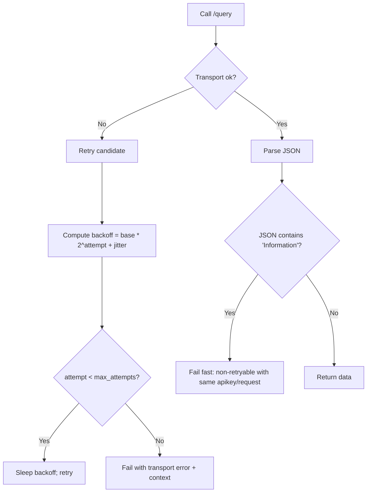

# Alpha Vantage Sandbox API Guide for Codex

<!--
Source constraint: This guide is derived ONLY from alphavantage.co (official documentation + official support/premium pages) and live responses from alphavantage.co/query.
Current date (Europe/London): 2026-03-20
Purpose: Markdown formatted for Codex-style ingestion (clear contracts, explicit unknowns, examples, and error handling).
-->

## Executive summary

This guide specifies how a Codex-driven agent should call the entity["company","Alpha Vantage Inc.","financial data provider"] REST API in a *sandbox/testing mode* using the same public host and `/query` endpoint shown throughout the official documentation (i.e., requests are expressed as URL query strings). citeturn13view0turn19view0turn44view0

Key points for a Codex agent:

The API surface (for this guide) is a **single HTTP endpoint**:

- Base path: `https://www.alphavantage.co/query` (all functions below are selected via the `function=` query parameter). citeturn13view0turn19view0turn44view0

Authentication is **API-key-in-query-string**:

- Every documented endpoint requires `apikey`. Documentation examples use `apikey=demo` and explicitly instruct developers to replace it with their own key obtained from the support page. citeturn13view0turn19view0turn14view0turn16view0

Sandbox behaviour observed with `apikey=demo`:

- Some requests succeed (e.g., `TIME_SERIES_DAILY`, `TIME_SERIES_INTRADAY`, `FX_DAILY`, `FX_INTRADAY`, and `CURRENCY_EXCHANGE_RATE`). citeturn32view0turn11view0turn34view0turn33view0turn27view0  
- Some requests return a JSON error payload with an `Information` field stating the demo key is “for demo purposes only” and prompting the caller to claim a free key (e.g., `TIME_SERIES_DAILY` with `outputsize=full`, technical indicators such as `SMA`, and crypto endpoints such as `CRYPTO_INTRADAY` and `DIGITAL_CURRENCY_DAILY`). citeturn27view1turn30view0turn28view0turn29view0

Rate limits (officially stated):

- Standard/free usage is “up to **25 requests per day**” (official support FAQ). citeturn5view0  
- Premium plans advertise **requests per minute tiers** (75/150/300/600/1200 requests/min) and “**no daily limits**” (official premium page). citeturn12view0  
- The documentation also references premium plans and per-minute tiers in context of premium functions. citeturn4view0turn13view0  
- **Throttling response format for exceeding those limits is not described on alphavantage.co pages retrieved for this report** → treat as **unknown** unless you observe a concrete payload in your environment. citeturn5view0turn12view0

Response formats (officially documented):

- Many endpoints support `datatype=json` (default) or `datatype=csv`. citeturn13view0turn19view0turn21view0turn24view0turn16view0  
- Some endpoints are described as using CSV for performance (e.g., IPO calendar), but **this guide does not claim a working CSV fetch in your sandbox** (see “Unknowns”). citeturn14view0  
- **XML is not documented** in the retrieved official docs for these endpoints → treat XML support as **unknown / not supported**. citeturn13view0turn19view0turn16view0

Mermaid flow diagrams (request→response, retry logic) are provided below.

## Authentication and sandbox environment

### Authentication method

All endpoints in this guide use the same authentication mechanism:

- **Query-string API key**: `apikey=<your_key>` is required. citeturn13view0turn14view0turn16view0turn21view0  
- Official code snippets show requests made by passing a fully formed URL (with `apikey=demo` in examples) and then parsing JSON. citeturn13view0turn19view0turn44view0

Observed “demo” sandbox behaviour:

- The documentation says examples are “for demo purposes” and uses `apikey=demo`. citeturn13view0turn19view0  
- Live responses show that `apikey=demo` may return either real data or an `Information` message indicating the demo key is limited. citeturn32view0turn11view0turn27view1turn30view0turn28view0turn29view0

Practical implication for Codex:

A Codex agent MUST treat `apikey=demo` as a *sandbox credential with partial coverage*. If it gets an `Information` response, it should not assume the endpoint is broken—only that the sandbox credential is insufficient for that specific request. citeturn27view1turn30view0turn28view0turn29view0

### Rate limits and quota

Officially stated standard/free limits:

- Alpha Vantage support FAQ: free service covering most datasets is “up to **25 requests per day**”. citeturn5view0

Officially stated premium characteristics:

- Premium page lists tiers (75/150/300/600/1200 requests per minute) and states “**No daily limits**.” citeturn12view0  
- The documentation references premium plans (including 600/1200 requests per minute) in context of premium functions. citeturn4view0turn13view0

Throttling behaviour:

- The specific HTTP status codes and the exact error payload for exceeding daily/per-minute limits are **not specified in the extracted documents** → treat them as **unknown** and design your client to detect both HTTP-level failures and JSON-body errors. citeturn5view0turn12view0

### Request→response flow

```mermaid
flowchart TD
  A[Choose use case: equity | forex | crypto | indicator] --> B[Select function=...]
  B --> C[Assemble query parameters + apikey]
  C --> D[HTTP request to https://www.alphavantage.co/query]
  D --> E{HTTP status == 200?}
  E -- No / unknown --> F[Treat as transport error; consider retry policy]
  E -- Yes --> G[Parse response body]
  G --> H{Body is JSON object with data keys?}
  H -- Yes --> I[Return structured result to caller]
  H -- No / body has 'Information' --> J[Classify as API-level error (e.g., demo key 제한)]
  J --> K[Decide: fail-fast vs retry vs request change]
```

citeturn13view0turn44view0turn27view1turn11view0

## Endpoints and parameters

### API surface model

For the use cases requested (time series, forex, crypto, indicators), the official documentation expresses endpoints as:

- `https://www.alphavantage.co/query?function=<FUNCTION_NAME>&...&apikey=<KEY>` citeturn13view0turn19view0turn14view0turn16view0

So, in this guide:

- **“Endpoint”** = the base path plus a specific `function=` value and its parameter contract.  
- **“Full path”** is always `https://www.alphavantage.co/query` plus the query string shown per function. citeturn13view0turn19view0turn14view0turn16view0

### Quick-reference table of endpoints

This table is intentionally short (Codex quick lookup). Full parameter contracts follow.

| Use case | Function (`function=`) | Full path (base) | Required params | Optional params (common) | Default response |
|---|---|---|---|---|---|
| Equity intraday OHLCV | `TIME_SERIES_INTRADAY` | `https://www.alphavantage.co/query` | `symbol`, `interval`, `apikey` | `adjusted`, `extended_hours`, `month`, `outputsize`, `datatype`, `entitlement` | JSON (default) / CSV via `datatype` citeturn13view0 |
| Equity daily OHLCV | `TIME_SERIES_DAILY` | `https://www.alphavantage.co/query` | `symbol`, `apikey` | `outputsize`, `datatype` | JSON (default) / CSV via `datatype` citeturn19view0 |
| Equity daily adjusted | `TIME_SERIES_DAILY_ADJUSTED` | `https://www.alphavantage.co/query` | `symbol`, `apikey` | `outputsize`, `datatype`, `entitlement` | JSON (default) / CSV via `datatype` citeturn35view0 |
| Equity weekly | `TIME_SERIES_WEEKLY` | `https://www.alphavantage.co/query` | `symbol`, `apikey` | `datatype` | JSON (default) / CSV via `datatype` citeturn21view0 |
| Equity weekly adjusted | `TIME_SERIES_WEEKLY_ADJUSTED` | `https://www.alphavantage.co/query` | `symbol`, `apikey` | `datatype` | JSON (default) / CSV via `datatype` citeturn21view0 |
| Equity monthly | `TIME_SERIES_MONTHLY` | `https://www.alphavantage.co/query` | `symbol`, `apikey` | `datatype` | JSON (default) / CSV via `datatype` citeturn22view0 |
| Equity monthly adjusted | `TIME_SERIES_MONTHLY_ADJUSTED` | `https://www.alphavantage.co/query` | `symbol`, `apikey` | `datatype` | JSON (default) / CSV via `datatype` citeturn22view0 |
| Forex exchange rate | `CURRENCY_EXCHANGE_RATE` | `https://www.alphavantage.co/query` | `from_currency`, `to_currency`, `apikey` | (none documented) | JSON citeturn14view0 |
| Forex intraday | `FX_INTRADAY` | `https://www.alphavantage.co/query` | `from_symbol`, `to_symbol`, `interval`, `apikey` | `outputsize`, `datatype` | JSON (default) / CSV via `datatype` citeturn24view0 |
| Forex daily | `FX_DAILY` | `https://www.alphavantage.co/query` | `from_symbol`, `to_symbol`, `apikey` | `outputsize`, `datatype` | JSON (default) / CSV via `datatype` citeturn24view0 |
| Forex weekly | `FX_WEEKLY` | `https://www.alphavantage.co/query` | `from_symbol`, `to_symbol`, `apikey` | `datatype` | JSON (default) / CSV via `datatype` citeturn25view0 |
| Forex monthly | `FX_MONTHLY` | `https://www.alphavantage.co/query` | `from_symbol`, `to_symbol`, `apikey` | `datatype` | JSON (default) / CSV via `datatype` citeturn26view0 |
| Crypto intraday | `CRYPTO_INTRADAY` | `https://www.alphavantage.co/query` | `symbol`, `market`, `interval`, `apikey` | `outputsize`, `datatype` | JSON (default) / CSV via `datatype` citeturn17view0 |
| Crypto daily historical | `DIGITAL_CURRENCY_DAILY` | `https://www.alphavantage.co/query` | `symbol`, `market`, `apikey` | `datatype` (via examples) | JSON / CSV (documented) citeturn18view0 |
| Indicator (example) | `SMA` | `https://www.alphavantage.co/query` | `symbol`, `interval`, `time_period`, `series_type`, `apikey` | `month`, `datatype`, `entitlement` | JSON (default) / CSV via `datatype` citeturn16view0 |

### Equity time series endpoints

#### TIME_SERIES_INTRADAY

Purpose:

- Intraday OHLCV data; documentation describes current and 20+ years of history, raw or split/dividend adjusted, with optional extended-hours inclusion; it also defines “candles” terminology. citeturn13view0

Full path template:

```text
https://www.alphavantage.co/query?function=TIME_SERIES_INTRADAY&symbol={SYMBOL}&interval={INTERVAL}&apikey={APIKEY}
```

Parameter contract (all query params are sent as URL query strings; types below describe intended semantics):

| Param | Required | Type (semantic) | Allowed / format | Example |
|---|---:|---|---|---|
| `function` | Yes | string literal | `TIME_SERIES_INTRADAY` | `TIME_SERIES_INTRADAY` citeturn13view0 |
| `symbol` | Yes | string | equity ticker | `IBM` citeturn13view0 |
| `interval` | Yes | enum string | `1min`, `5min`, `15min`, `30min`, `60min` | `5min` citeturn13view0 |
| `adjusted` | No | boolean-like | default `true`; set `false` for raw/intraday | `adjusted=false` citeturn13view0 |
| `extended_hours` | No | boolean-like | default `true`; set `false` for regular session only | `extended_hours=false` citeturn13view0 |
| `month` | No | YYYY-MM string | specific month (since 2000-01) | `month=2009-01` citeturn13view0 |
| `outputsize` | No | enum string | default `compact`; `compact`=latest 100 points; `full`=trailing 30 days (if no `month`) or full month (if `month` set) | `outputsize=full` citeturn13view0 |
| `datatype` | No | enum string | default `json`; `json` or `csv` | `datatype=csv` citeturn13view0 |
| `entitlement` | No | enum string | unset=historical; `realtime` or `delayed` | `entitlement=delayed` citeturn13view0 |
| `apikey` | Yes | string | your key | `demo` (docs) citeturn13view0 |

Pagination/windowing notes:

- There is no “page” parameter documented for intraday; Alpha Vantage instead provides *windowing controls* via `outputsize` and `month`. citeturn13view0

#### TIME_SERIES_DAILY

Purpose:

- Raw daily OHLCV (20+ years), with guidance to use the “Daily Adjusted” API for split/dividend adjustments. citeturn19view0

Full path template:

```text
https://www.alphavantage.co/query?function=TIME_SERIES_DAILY&symbol={SYMBOL}&apikey={APIKEY}
```

Parameters:

| Param | Required | Type (semantic) | Allowed / format | Example |
|---|---:|---|---|---|
| `function` | Yes | string literal | `TIME_SERIES_DAILY` | `TIME_SERIES_DAILY` citeturn19view0 |
| `symbol` | Yes | string | equity ticker | `IBM` citeturn19view0 |
| `outputsize` | No | enum string | default `compact`; `compact`=latest 100 points; `full`=20+ years; docs state `full` is premium-only | `outputsize=full` citeturn19view0 |
| `datatype` | No | enum string | default `json`; `json` or `csv` | `datatype=csv` citeturn19view0 |
| `apikey` | Yes | string | your key | `demo` (docs) citeturn19view0 |

#### TIME_SERIES_DAILY_ADJUSTED

Purpose:

- Daily OHLCV plus adjusted close and split/dividend events; docs label it premium and include `entitlement` freshness control. citeturn35view0

Full path template:

```text
https://www.alphavantage.co/query?function=TIME_SERIES_DAILY_ADJUSTED&symbol={SYMBOL}&apikey={APIKEY}
```

Parameters:

| Param | Required | Type (semantic) | Allowed / format | Example |
|---|---:|---|---|---|
| `function` | Yes | string literal | `TIME_SERIES_DAILY_ADJUSTED` | `TIME_SERIES_DAILY_ADJUSTED` citeturn35view0 |
| `symbol` | Yes | string | equity ticker | `IBM` citeturn35view0 |
| `outputsize` | No | enum string | default `compact`; `compact`=latest 100; `full`=20+ years | `outputsize=compact` citeturn35view0 |
| `datatype` | No | enum string | default `json`; `json` or `csv` | `datatype=json` citeturn35view0 |
| `entitlement` | No | enum string | unset=historical; `realtime` or `delayed` | `entitlement=delayed` citeturn35view0 |
| `apikey` | Yes | string | your key | `demo` (docs) citeturn35view0 |

#### TIME_SERIES_WEEKLY and TIME_SERIES_WEEKLY_ADJUSTED

Both endpoints:

- Require `function`, `symbol`, `apikey`, and accept optional `datatype`. citeturn21view0

The adjusted variant returns weekly adjusted close and dividend fields (per description). citeturn21view0

#### TIME_SERIES_MONTHLY and TIME_SERIES_MONTHLY_ADJUSTED

Both endpoints:

- Require `function`, `symbol`, `apikey`, and accept optional `datatype`. citeturn22view0

The adjusted variant returns monthly adjusted close and dividend fields (per description). citeturn22view0

### Forex endpoints

#### CURRENCY_EXCHANGE_RATE

Purpose:

- Real-time exchange rate for a currency pair; docs allow “physical currency” or “cryptocurrency” codes in `from_currency`/`to_currency`. citeturn14view0turn17view0

Full path template:

```text
https://www.alphavantage.co/query?function=CURRENCY_EXCHANGE_RATE&from_currency={FROM}&to_currency={TO}&apikey={APIKEY}
```

Parameters:

| Param | Required | Type (semantic) | Allowed / format | Example |
|---|---:|---|---|---|
| `function` | Yes | string literal | `CURRENCY_EXCHANGE_RATE` | `CURRENCY_EXCHANGE_RATE` citeturn14view0 |
| `from_currency` | Yes | string | physical currency or crypto code | `USD` / `BTC` citeturn14view0 |
| `to_currency` | Yes | string | physical currency or crypto code | `JPY` / `EUR` citeturn14view0 |
| `apikey` | Yes | string | your key | `demo` (docs) citeturn14view0 |

#### FX_INTRADAY, FX_DAILY, FX_WEEKLY, FX_MONTHLY

The intraday variant requires `interval` and supports `outputsize`; daily supports `outputsize`; weekly/monthly do not document `outputsize`. All support `datatype` and require `apikey`. citeturn24view0turn25view0turn26view0

### Crypto endpoints

Crypto exchange rate reuses `CURRENCY_EXCHANGE_RATE` as documented in the “Digital & Crypto Currencies” section. citeturn17view0

#### CRYPTO_INTRADAY

Purpose:

- Intraday crypto OHLCV; requires crypto `symbol`, quote `market`, and `interval`; supports `outputsize` and `datatype`; docs label it premium. citeturn17view0turn18view0

#### DIGITAL_CURRENCY_DAILY / WEEKLY / MONTHLY

Purpose:

- Historical daily/weekly/monthly crypto time series for a crypto traded on a market; docs note daily refresh at midnight UTC for the daily endpoint and that prices/volumes are quoted in both market currency and USD. citeturn18view0

### Technical indicators

The documentation lists a broad catalogue of technical-indicator functions (far more than can be exhaustively re-specified here); the “Technical Indicators” table of contents includes (among others) `SMA`, `EMA`, `RSI`, `STOCH`, `ADX`, `BBANDS`, `OBV`, etc. citeturn13view0turn15view3

Indicator example: `SMA` parameter contract:

- Required: `function=SMA`, `symbol`, `interval`, `time_period`, `series_type`, `apikey`. Optional: `month`, `datatype`, `entitlement`. citeturn16view0  
- The docs explicitly show indicator usage for both equities and FX/crypto pairs (e.g., `symbol=USDEUR`). citeturn16view0turn15view4

## Request construction, encoding, and examples

### Query parameter encoding and safe construction

What the official docs show:

- Requests are built as a URL string (examples) and fetched with standard HTTP clients (e.g., `requests.get(url)` in Python examples). citeturn13view0turn44view0

Codex guidance (operational):

- Prefer passing query parameters as a dictionary/map to your HTTP library (so URL-encoding is handled correctly) rather than manually concatenating strings.  
- **Encoding rules**: alphavantage.co docs retrieved for this report do not define special encoding rules; treat query construction as standard URL encoding behaviour (unknowns remain unknown). citeturn13view0turn19view0

### Pagination and data volume controls

No explicit pagination parameters are documented for time series / FX / crypto / indicators in the sections retrieved.

Instead, use documented windowing controls:

- `outputsize=compact|full` is widely used (time series, FX intraday/daily, crypto intraday). citeturn13view0turn19view0turn24view0turn17view0  
- `month=YYYY-MM` provides month-scoped history for `TIME_SERIES_INTRADAY` and is also available for indicators such as `SMA`. citeturn13view0turn16view0

### Response formats

Documented formats:

- Default `datatype=json` and optional `datatype=csv` are documented across many endpoints (intraday, daily, weekly, FX, technical indicators, crypto intraday). citeturn13view0turn19view0turn21view0turn24view0turn16view0turn17view0  
- Some endpoints are described as using CSV for performance (e.g., IPO calendar). citeturn14view0

XML:

- Not documented in the retrieved alphavantage.co pages for these endpoints → treat as **unknown**. citeturn13view0turn19view0turn16view0

### cURL examples

Equity daily (sandbox demo key; known to succeed):

```bash
curl -s "https://www.alphavantage.co/query?function=TIME_SERIES_DAILY&symbol=IBM&apikey=demo"
```

citeturn32view0

Equity intraday:

```bash
curl -s "https://www.alphavantage.co/query?function=TIME_SERIES_INTRADAY&symbol=IBM&interval=5min&apikey=demo"
```

citeturn13view0turn11view0

Forex exchange rate:

```bash
curl -s "https://www.alphavantage.co/query?function=CURRENCY_EXCHANGE_RATE&from_currency=USD&to_currency=JPY&apikey=demo"
```

citeturn14view0turn27view0

Forex intraday:

```bash
curl -s "https://www.alphavantage.co/query?function=FX_INTRADAY&from_symbol=EUR&to_symbol=USD&interval=5min&apikey=demo"
```

citeturn24view0turn33view0

Indicator example (`SMA`) — documented contract, but demo key may fail:

```bash
curl -s "https://www.alphavantage.co/query?function=SMA&symbol=IBM&interval=weekly&time_period=10&series_type=open&apikey=demo"
```

citeturn16view0turn30view0

### Python examples

Robust request helper (Codex-friendly; preserves original API error payloads)

```python
import os
import time
import random
from typing import Any, Dict, Optional

import requests

BASE_URL = "https://www.alphavantage.co/query"

class AlphaVantageError(RuntimeError):
    """Raised when the API returns an error payload in JSON."""

def av_get(params: Dict[str, str], timeout_s: int = 30) -> Dict[str, Any]:
    """
    Call Alpha Vantage /query with the supplied params.
    - params must include: function, apikey, plus any function-specific required params.
    - returns parsed JSON on success
    - raises AlphaVantageError if the response JSON contains known error keys
    """
    r = requests.get(BASE_URL, params=params, timeout=timeout_s)
    # Docs do not specify status codes; examples check statusCode != 200. Treat non-200 as transport error.
    r.raise_for_status()

    data = r.json()

    # Observed and documented error shapes often use an "Information" key (e.g., demo-key limitation).
    # Other error keys are not confirmed by alphavantage.co sources in this report, so keep this minimal.
    if isinstance(data, dict) and "Information" in data:
        raise AlphaVantageError(data["Information"])

    return data

def example_time_series_daily_demo() -> Dict[str, Any]:
    return av_get({
        "function": "TIME_SERIES_DAILY",
        "symbol": "IBM",
        "apikey": "demo",
    })

def example_fx_intraday_demo() -> Dict[str, Any]:
    return av_get({
        "function": "FX_INTRADAY",
        "from_symbol": "EUR",
        "to_symbol": "USD",
        "interval": "5min",
        "apikey": "demo",
    })
```

citeturn44view0turn24view0turn19view0turn27view1turn32view0turn33view0

## Responses, errors, and retry guidance

### Sample successful responses

Equity intraday JSON (truncated):

```json
{
  "Meta Data": {
    "1. Information": "Intraday (5min) open, high, low, close prices and volume",
    "2. Symbol": "IBM",
    "3. Last Refreshed": "2026-03-19 19:55:00",
    "4. Interval": "5min",
    "5. Output Size": "Compact",
    "6. Time Zone": "US/Eastern"
  },
  "Time Series (5min)": {
    "2026-03-19 19:55:00": {
      "1. open": "250.7500",
      "2. high": "250.7600",
      "3. low": "250.7500",
      "4. close": "250.7600",
      "5. volume": "9"
    }
  }
}
```

citeturn11view0

Forex exchange rate JSON:

```json
{
  "Realtime Currency Exchange Rate": {
    "1. From_Currency Code": "USD",
    "2. From_Currency Name": "United States Dollar",
    "3. To_Currency Code": "JPY",
    "4. To_Currency Name": "Japanese Yen",
    "5. Exchange Rate": "159.27500000",
    "6. Last Refreshed": "2026-03-19 08:50:30",
    "7. Time Zone": "UTC",
    "8. Bid Price": "159.27410000",
    "9. Ask Price": "159.27730000"
  }
}
```

citeturn27view0

### Sample error responses

Demo key “limited access” error (example triggered by `TIME_SERIES_DAILY` + `outputsize=full`):

```json
{
  "Information": "The **demo** API key is for demo purposes only. Please claim your free API key at (https://www.alphavantage.co/support/#api-key) to explore our full API offerings. It takes fewer than 20 seconds."
}
```

citeturn27view1

The same error shape is observed for other requests in this sandbox context (e.g., crypto intraday, digital currency daily, technical indicators). citeturn28view0turn29view0turn30view0

### Error handling requirements for Codex agents

Preserve original error payloads:

- Alpha Vantage explicitly asks wrapper/library authors to preserve the content of JSON/CSV responses “in both success and error cases” so users retain the original debugging information. citeturn5view0

Therefore:

- Do not replace the server’s message with a generic “failed” unless you also retain and surface the original `Information` payload (or any other error payload you observe). citeturn5view0turn27view1

Classifying errors (based only on confirmed sources):

- If response JSON contains `Information` with the demo-key message, treat it as **non-retryable with the same credential** (action: change API key or change request scope). citeturn27view1turn28view0turn30view0  
- If HTTP status is non-200: docs’ Node examples treat `res.statusCode !== 200` as an error path, but do not define a mapping of errors to status codes → classification beyond “transport error” is **unknown**. citeturn13view0turn25view0turn44view0

### Retry and exponential backoff in the sandbox

What is known:

- A standard/free plan is limited to 25 requests/day; premium plans are expressed in requests/minute and state no daily limits. citeturn5view0turn12view0  
- The official docs retrieved do **not** specify: (a) which error field indicates quota exhaustion, (b) whether quota exhaustion is per-minute vs per-day for free keys, (c) whether `Retry-After` headers are returned, (d) a recommended backoff schedule. These are **unknown** from the constrained sources. citeturn5view0turn12view0

Codex-safe retry guidance (conservative, based on known constraints and observed payloads):

- If you receive the demo-key `Information` response, **do not retry**; that response is not a transient overload signal. citeturn27view1turn30view0  
- If you receive an HTTP-level failure (timeouts, connection errors, non-200), you may retry a small number of times with exponential backoff *for transport reliability* (this is general HTTP hygiene; Alpha Vantage-specific recommended intervals are unknown). citeturn44view0turn5view0  
- If you suspect you are hitting a quota (e.g., repeated failures after many requests), stop retrying and surface the error; for daily caps, “waiting” is unlikely to help within the same day. The exact server signal is unknown, but the presence of a daily limit is explicit. citeturn5view0

Retry logic (Mermaid):



citeturn27view1turn44view0turn5view0

## Testing checklist

Use this checklist when validating a Codex agent in your sandbox environment (and do not assume unsupported items are available).

Authentication and environment:

- Confirm every request includes `apikey`. citeturn13view0turn14view0turn16view0  
- Verify that **some** demo requests succeed (e.g., `TIME_SERIES_DAILY`, `TIME_SERIES_INTRADAY`, `FX_DAILY`, `FX_INTRADAY`, `CURRENCY_EXCHANGE_RATE`). citeturn32view0turn11view0turn34view0turn33view0turn27view0  
- Verify that **some** demo requests fail and return the `Information` error payload (e.g., `TIME_SERIES_DAILY` with `outputsize=full`, `SMA`, `CRYPTO_INTRADAY`). citeturn27view1turn30view0turn28view0

Endpoints and parameters:

- Intraday: validate required `symbol`, `interval` and optional `adjusted`, `extended_hours`, `month`, `outputsize`, `datatype`, `entitlement` are correctly propagated. citeturn13view0  
- Daily: validate `outputsize=compact|full` logic; note docs say full may be premium-only. citeturn19view0turn27view1  
- FX: validate `from_symbol`, `to_symbol` and `interval` where required; validate `outputsize` where documented. citeturn24view0turn25view0turn26view0  
- Indicators: validate `time_period` and `series_type` handling; validate FX-pair symbol format shown in examples (e.g., `USDEUR`). citeturn16view0turn15view4

Response parsing:

- Time series: confirm you can parse `Meta Data` and the relevant “Time Series (...)” object keys. citeturn11view0turn32view0turn34view0turn33view0  
- Exchange rate: confirm you can parse the `Realtime Currency Exchange Rate` object. citeturn27view0  
- Error payload: confirm you detect and surface `Information` as an API-level error without losing message contents. citeturn5view0turn27view1

Rate limiting / quota:

- Confirm your client enforces a local request budget aligned with 25 requests/day for free usage OR a configured premium requests/min budget. citeturn5view0turn12view0  
- Confirm your retry logic does not retry non-retryable `Information` errors. citeturn27view1turn30view0

Unknowns to explicitly track in your implementation (do not assume):

- Whether Alpha Vantage returns a dedicated throttle key (e.g., `Note`) and/or `Retry-After` headers when quota is exceeded (not specified in the constrained sources). citeturn5view0turn12view0  
- XML response availability (not documented). citeturn13view0turn19view0turn16view0