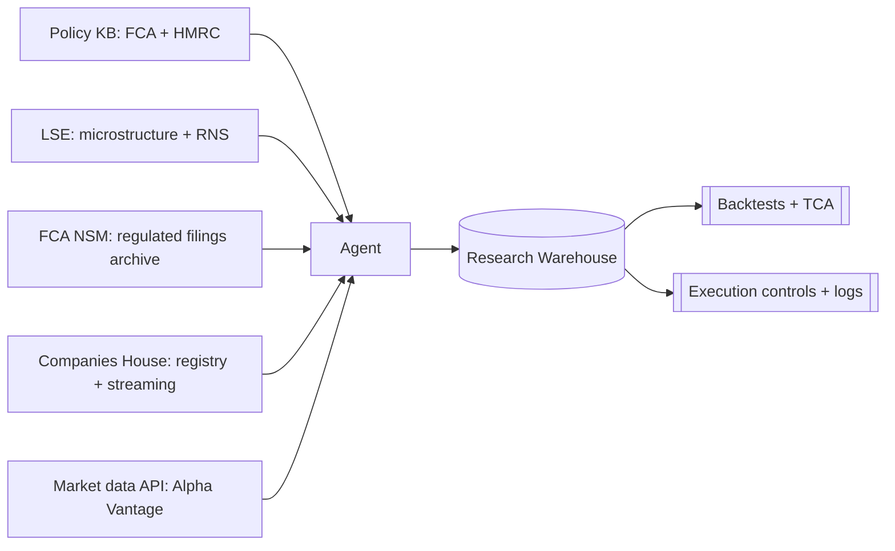

# Best Free Data Sources for Professional UK Stock Trading Codex  
**Date:** 2026-03-20 (Europe/London)  
**Assumptions (explicit):** You specified **no budget constraint** and did not specify trading style, asset universe beyond “stocks”, or time horizon; therefore I assume **no specific constraint** on (a) frequency (intra‑day to long‑term), (b) UK vs global equities (UK‑focused preferred), (c) discretionary vs systematic, and (d) toolchain (any stack acceptable). The ranking below is still intentionally restricted to **five free, accessible sources** as requested.

## Executive summary

The best way to learn equity trading “like a professional” in the UK is to treat it as an engineering+governance problem first: **what is lawful**, **what is compliant**, **what is taxable**, and **how the venue actually matches orders**. Free sources can cover those pillars unusually well in the UK because the critical truths are published by public bodies and the exchange. Where free sources are weakest is **professional-grade market data** (depth, tick‑precision history, and redistribution rights): free market APIs exist, but quotas and licensing restrictions typically constrain them to learning and small prototypes rather than production trading.

**Ranked top five free sources (UK‑focused where possible):**  
1) **FCA Handbook + National Storage Mechanism (NSM)** — canonical UK conduct rules and a free disclosure archive, but explicitly not intended as a real‑time feed and includes third‑party uploads not necessarily verified. citeturn0search0turn4search2turn4search6turn4search10  
2) **HMRC manuals + GOV.UK CGT rates** — canonical operational tax position and mechanics (investor vs trader posture, share pooling/matching, CGT rates, SDRT), but classification is facts-and-circumstances. citeturn0search2turn0search3turn4search0turn4search1  
3) **London Stock Exchange (MIT201 + Rulebook + RNS access + market‑data terms/policy)** — canonical microstructure and venue rules; free docs are excellent, but access to live RNS on the public site is gated by licensing and market‑data usage is governed by contractual terms/policies. citeturn2search0turn2search2turn2search12turn2search3turn2search11  
4) **Companies House (REST + Streaming API + service information)** — canonical UK corporate register APIs (issuer structure, filings, change events), explicit rate limits, and explicit disclaimer that filings are not verified/validated for accuracy. citeturn1search14turn1search4turn1search3turn1search9  
5) **Alpha Vantage (free market‑data API)** — pragmatic free market‑data API for learning pipelines with documented UK ticker syntax, but strict quotas and a terms-of-service definition of “commercial use” that can capture professional research/testing/monitoring. citeturn3search2turn3search0turn3search1  

**Conflict resolution rule (mandatory for an agent):** when sources contradict, follow **law → FCA → HMRC → exchange → vendor**. UK Market Abuse law sets the outer boundary of permitted conduct. citeturn0search0turn0search2turn2search2turn3search1turn0search1  

**Downloadable codex package:**  
```text
sandbox:/mnt/data/uk_elite_trader_codex_markdown.zip
```  

The remainder of this document provides: methodology, the ranked analysis (reliability, coverage, limits/licensing, strengths/weaknesses/biases, contradictions), comparison tables, mermaid diagrams, example API calls, and then the **full codex markdown files inline** (so you can paste into VS Code and split into files).

## Methodology and scoring approach

### What “reliable” means here  
A source is “reliable” in this report if it is (a) **authoritative for UK obligations or venue mechanics**, (b) published with stable provenance and meaningful governance (rulebooks, manuals, term documents), (c) sufficiently current or explicitly versioned, and (d) usable in practice (accessible without paywalls for core content). The FCA, HMRC, the exchange and Companies House are advantaged because they are primary issuers of the relevant obligations and mechanics. citeturn0search0turn0search2turn2search0turn1search14  

### Categories required by your brief  
Each source is mapped to these categories: **regulation**, **tax**, **market data**, **order execution**, **strategy research**, **historical data**, **APIs**, **educational material**.

### Ranking logic  
The ranking is “governance-first” because in professional trading the highest-cost failures are compliance/tax/venue misuse. The first four sources are fixed by UK reality (regulator, tax authority, primary venue documentation, corporate register). The fifth slot is reserved for a **free market‑data API** suitable for learning pipelines, with explicit accounting for its **quota and licensing restrictions**. citeturn3search0turn3search1turn2search11  

## Ranked top five sources

### Rank one: Financial Conduct Authority  
**Why reliable (authority, data quality, update frequency, coverage).** The FCA Handbook contains binding requirements and guidance; for algorithmic trading, MAR 7A.3 sets out requirements including resilient systems/capacity, thresholds and limits, and controls to prevent erroneous orders and disorderly markets. citeturn0search0turn0search12 The FCA NSM is the FCA’s free-to-use disclosure archive enabling users to view/download and export search results to CSV. citeturn0search9turn4search10 The FCA NSM page shows an explicit update trail (“last updated”), supporting operational currency claims at a page level. citeturn4search10  

**What it provides (mapped to categories).**  
Regulation and execution governance are the core: MAR 7A.3 (algo controls), and best‑execution obligations in COBS 11.2A (for firms executing client orders) define the institutional standard (and are often used as a reference point even in prop contexts). citeturn0search0turn4search3 Disclosures: NSM stores regulated announcements and disclosed documents and supports search by identifiers and text. citeturn0search9turn4search2  

**Access, usage limits, licensing constraints.** The NSM user guide states that the NSM is not intended to be a real‑time service; information is generally publicly available within an hour of submission and disclosures are held indefinitely as an archive. citeturn4search2 The guide also states a maximum export of 4,000 records to CSV. citeturn0search1 The FCA explicitly notes that NSM materials are uploaded by third parties and may not have been verified or approved by the FCA. citeturn4search6 Practical access requires accepting terms of use when you enter the NSM portal (as described in the user guide). citeturn4search2  

**Strengths.** FCA rules and FCA-hosted disclosure infrastructure are the most defensible inputs for an agent’s compliance layer and for “public information provenance” in event-driven workflows. citeturn0search0turn0search9  

**Weaknesses and biases.** FCA content is compliance‑centric; it will not teach strategy alpha. NSM is archive-first (not real time) and explicitly includes unverified third‑party submissions, meaning an agent must implement verification/cross‑checks and must not treat NSM as an ultra‑low‑latency news feed. citeturn4search2turn4search6  

**Common contradictions and resolution.**  
*Contradiction:* “NSM is a news feed” vs “NSM is archival and not real time.”  
*Resolution:* Follow the FCA’s documented position: NSM is not real time; use it as the audit archive, not the fastest dissemination layer. citeturn4search2  

**Primary links (direct, in code block).**  
```text
FCA Handbook (home): https://handbook.fca.org.uk/home
FCA MAR 7A.3 (requirements for algorithmic trading): https://handbook.fca.org.uk/handbook/MAR/7A/3.html
FCA COBS 11.2A (best execution – MiFID provisions): https://handbook.fca.org.uk/handbook/COBS/11/2A.html
FCA NSM landing page (update trail + free CSV export): https://www.fca.org.uk/markets/primary-markets/regulatory-disclosures/national-storage-mechanism
FCA NSM user guide (not real time; archive; 4,000 export cap): https://www.fca.org.uk/publication/primary-market/nsm-investor-user-guide.pdf
FCA NSM help/FAQs (unverified third-party uploads; not real time): https://www.fca.org.uk/publication/primary-market/fca-nsm-help-and-faqs.pdf
NSM portal entry point: https://data.fca.org.uk/#/nsm/nationalstoragemechanism
```

### Rank two: HM Revenue & Customs  
**Why reliable (authority, data quality, update frequency, coverage).** HMRC manuals are the most operationally useful articulation of HMRC’s administrative position on (a) whether activity is trading vs investment/speculation and (b) how to compute gains mechanically. HMRC states that transactions in financial assets such as shares normally do not amount to trading for tax purposes and that many short‑term speculative transactions still fall short of trading. citeturn0search2 HMRC’s Capital Gains Manual explains that shares of the same class in the same company normally become part of the Section 104 holding (the pooling mechanism) and that same‑day and “bed and breakfasting” identification rules keep shares out of the pool. citeturn0search3 GOV.UK publishes current CGT rate schedules with clear effective dates, indicating active maintenance as policy changes. citeturn4search1turn4search5  

**What it provides (mapped to categories).**  
HMRC dominates **tax** categories: classification posture and badges-of-trade framing, share disposal matching/pooling mechanics, CGT rates (via GOV.UK), and SDRT guidance including the principal charge rate (0.5%) for consideration in scope. citeturn0search2turn0search3turn4search0turn4search1  

**Access, usage limits, licensing constraints.** HMRC manuals and GOV.UK guidance are openly accessible without meaningful rate limits for human use. For licensing, UK government information is generally re-usable under the Open Government Licence v3.0 (subject to exceptions), and OGL 3.0 explicitly encourages use and re-use. citeturn3search10turn3search3turn3search14 An agent should still store provenance and date because guidance changes and rates are date-dependent. citeturn4search1turn4search5  

**Strengths.** HMRC manuals provide deterministic mechanics that can be encoded into a “tax lot engine” (same‑day and 30‑day matching, then Section 104 pooling) and into trading cost models that include SDRT where applicable. citeturn0search3turn4search0  

**Weaknesses and biases.** “Trading vs investing” classification remains facts-and-circumstances; HMRC guidance is not bespoke advice and may be conservatively interpreted in enforcement contexts. The manuals explicitly frame many speculative share transactions as falling short of trade, which can conflict with internet folklore about “day-trader status.” citeturn0search2  

**Common contradictions and resolution.**  
*Contradiction:* “Frequent share dealing is always a trade” (secondary sources) vs HMRC manuals saying share transactions normally do not amount to trading.  
*Resolution:* Follow HMRC’s administrative position in the absence of professional advice; build workflows that can evidence the facts-and-circumstances analysis (badges of trade) and compute CG consistently under the share identification rules. citeturn0search2turn0search3  

**Primary links (direct, in code block).**  
```text
HMRC BIM20250 (shares normally not a trade): https://www.gov.uk/hmrc-internal-manuals/business-income-manual/bim20250
HMRC BIM20205 (badges of trade overview): https://www.gov.uk/hmrc-internal-manuals/business-income-manual/bim20205
HMRC CG51550 (Section 104 holding / share pooling): https://www.gov.uk/hmrc-internal-manuals/capital-gains-manual/cg51550
GOV.UK CGT rates (current + previous years): https://www.gov.uk/capital-gains-tax/rates
GOV.UK CGT rates and allowances (guidance): https://www.gov.uk/guidance/capital-gains-tax-rates-and-allowances
HMRC STSM031010 (SDRT principal rate 0.5%): https://www.gov.uk/hmrc-internal-manuals/stamp-taxes-shares-manual/stsm031010
HMRC STSM031030 (SDRT consideration rules context): https://www.gov.uk/hmrc-internal-manuals/stamp-taxes-shares-manual/stsm031030
```

### Rank three: London Stock Exchange  
**Why reliable (authority, data quality, update frequency, coverage).** Venue microstructure is “ground truth” for order execution and slippage. The LSE’s **MIT201 Guide to the Trading System** is a versioned technical guide; the published version 15.7 (dated 08 December 2025) is an explicitly maintained artefact. citeturn2search0 The **Rules of the London Stock Exchange** are published with an effective date (19 January 2026), providing definitive venue rules and member-firm obligations. citeturn2search2turn2search6 The LSE (via LSEG) publishes terms for delayed data stating it is provided for information purposes only and is not investment advice/financial promotion, and also publishes market data policy documents describing redistribution/usage frameworks. citeturn2search3turn2search11turn2search19  

**What it provides (mapped to categories).**  
LSE is strongest on **order execution** (order types, priority, sessions/auctions), and on public disclosures via RNS (as the venue’s dissemination layer). The exchange also publishes market data terms and policies relevant to licensing and redistribution. citeturn2search0turn2search2turn2search11turn2search4  

**Access, usage limits, licensing constraints.** MIT201 and the rulebook are free PDFs. citeturn2search0turn2search2 However, access to live RNS on the public site can require confirming private-investor status due to licensing stipulations, which is an explicit friction and an implicit limitation for automated ingestion. citeturn2search12 Delayed market data access is governed by terms asserting it is informational and not advice/financial promotion. citeturn2search3 For broader market data usage and redistribution, the exchange publishes policy documents that define redistribution rights and conditions (contractual governance). citeturn2search11turn2search19  

**Strengths.** LSE documents teach the “physics” of execution—how orders are treated within the venue—and provide binding venue rules. For professional learning, that is a non-negotiable foundation because strategy backtests that ignore queueing, auction states, and venue-specific behaviours often fail when exposed to real execution. citeturn2search0turn2search2  

**Weaknesses and biases.** The exchange is not a strategy research provider; it is an operator and a market data licensor. Where retail users want free bulk market data, the exchange’s published terms and policies signal that professional-grade usage is typically contractual. citeturn2search3turn2search11 RNS public access friction (private investor confirmation) is a material barrier for an agent that aims to ingest announcements systematically without a licensed feed. citeturn2search12  

**Common contradictions and resolution.**  
*Contradiction:* “RNS is freely available for automation” vs licensing-gated access on the public site.  
*Resolution:* Follow exchange licensing signals: treat public RNS browsing as human-accessible and assume systematic ingestion requires licensed solutions. Use FCA NSM as the free archive layer, acknowledging it is not real-time. citeturn2search12turn4search2  

**Primary links (direct, in code block).**  
```text
LSE MIT201 (Guide to the trading system) PDF: https://docs.londonstockexchange.com/sites/default/files/documents/mit201-guide-to-the-trading-system-15-7-20251208.pdf
Rules of the London Stock Exchange (effective 19 January 2026) PDF: https://docs.londonstockexchange.com/sites/default/files/documents/rules-of-the-london-stock-exchange-effective-19-january-2026_0.pdf
Equities trading resources (document hub): https://www.londonstockexchange.com/resources/equities-trading-resources
RNS (public entry point): https://www.lse.co.uk/rns/
RNS overview (LSEG): https://www.lseg.com/en/capital-markets/regulatory-news-service
Delayed market data terms: https://www.londonstockexchange.com/delayed-market-data/terms-and-conditions.htm
LSE Market Data Policy (2025) PDF: https://docs.londonstockexchange.com/sites/default/files/documents/policies-2025_2.pdf
LSE market data policy guidance (Jan 2024) PDF: https://docs.londonstockexchange.com/sites/default/files/documents/rtmd-agreement-jan-2024.pdf
```

### Rank four: Companies House  
**Why reliable (authority, data quality, update frequency, coverage).** Companies House is the UK corporate register and provides both REST and Streaming APIs with explicit documentation. The Streaming API explicitly states it provides access to real-time data changes and pushes data as it changes via long‑running connections. citeturn1search3 Authentication is clearly specified: HTTP Basic Authentication with the API/stream key as the username and the password ignored/blank. citeturn1search9turn1search1 Rate limiting is explicit: 600 requests per five-minute period, returning HTTP 429 on breaches, with a stated right to ban applications that attempt to bypass limits. citeturn1search4  

The core data-quality caveat is also explicit: Companies House carries out basic checks for completion/signature but does not have statutory power/capability to verify accuracy; publication is not verification/validation. citeturn1search14  

**What it provides (mapped to categories).**  
Companies House provides **issuer identity and structure data** (company status, filings, officers/PSC/charges, etc.) and “event streams” usable for monitoring filings and corporate changes. It does not provide prices. Its educational value is highest for building an issuer master, reconciling identifiers, and creating event-driven research triggers. citeturn1search3turn1search14  

**Access, usage limits, licensing constraints.** Rate limits are explicit (600/5min with ban rights), which an agent must incorporate into ingestion design (caching, backoff, batching). citeturn1search4 The limitations on verification mean cross-validation is required for trading decisions (e.g., corroborate with issuer disclosures and audited reports). citeturn1search14  

**Strengths.** For professional learning, it is unusually good for practising: data ingestion discipline, reference data management, event-driven research plumbing, and reproducibility (by storing raw JSON with timestamps and IDs). The streaming API makes “near-real-time registry change detection” feasible in a free workflow. citeturn1search3  

**Weaknesses and biases.** Companies House is a publication register, not a truth verifier; its explicit disclaimer means naive “filing = fact” assumptions are unsafe. citeturn1search14  

**Common contradictions and resolution.**  
*Contradiction:* “Companies House data is verified” vs Companies House stating it does not verify/validate accuracy.  
*Resolution:* Follow Companies House’s own disclaimer; treat it as “what was filed” and validate with other authoritative disclosure sources (RNS/NSM) and audited documents. citeturn1search14turn0search9  

**Primary links (direct, in code block).**  
```text
Companies House developer hub: https://developer.company-information.service.gov.uk/
REST API developer guidelines (incl. rate limits): https://developer.company-information.service.gov.uk/developer-guidelines
Authentication (username=key, password ignored): https://developer.company-information.service.gov.uk/authentication
Authorisation guide (HTTP Basic example): https://developer-specs.company-information.service.gov.uk/guides/authorisation
Rate limiting (600 / 5 minutes; 429; bans): https://developer-specs.company-information.service.gov.uk/guides/rateLimiting
Streaming API overview (real-time changes): https://developer-specs.company-information.service.gov.uk/streaming-api/guides/overview
Service information (not verified/validated): https://resources.companieshouse.gov.uk/serviceInformation.shtml
API catalogue (streaming): https://www.api.gov.uk/ch/companies-house-streaming/
```

### Rank five: Alpha Vantage  
**Why reliable (authority, data quality, update frequency, coverage).** Alpha Vantage is not a UK primary authority, but it is a widely used learning tool because it provides a simple HTTP API for market data. Its documentation explicitly includes a UK London Stock Exchange sample ticker (TSCO.LON) for daily time series calls. citeturn3search2  

**What it provides (mapped to categories).**  
Alpha Vantage contributes primarily to **market data**, **historical data**, **APIs**, and **educational material** (API docs, examples). It does not provide UK compliance, tax, or venue microstructure rules. citeturn3search2  

**Access, usage limits, licensing/commercial-use constraints.** The support page states the free stock API service covers the majority of datasets for up to 25 requests per day. citeturn3search0 The terms of service grant a personal, non-commercial licence unless otherwise agreed, and define “commercial use” as including purposes beyond personal usage such as investment analysis, research, testing, and monitoring. citeturn3search1 This is central: “professional trader learning” often looks like research/testing/monitoring; an agent must treat the terms as binding and either constrain usage to compliant contexts or migrate to licensed datasets. citeturn3search1  

**Strengths.** Excellent for building and testing data pipelines, backtesting scaffolds, caching, and monitoring under tight quotas, and for practicing robust handling of vendor throttling. citeturn3search0turn3search2  

**Weaknesses and biases.** The free tier is materially quota constrained for systematic research. Vendor marketing naturally emphasises breadth and capability; for professional workflows, the enforceable artefacts are quotas and terms. citeturn3search0turn3search1  

**Common contradictions and resolution.**  
*Contradiction:* “I can use free market data for professional research/trading” vs vendor terms prohibiting commercial use without agreement.  
*Resolution:* Follow vendor terms (the “vendor” layer in the hierarchy). For professional work, budget for appropriately licensed market data and treat free APIs as learning/prototyping inputs only unless you have written permission. citeturn3search1turn2search11  

**Primary links (direct, in code block).**  
```text
Alpha Vantage documentation (UK ticker example): https://www.alphavantage.co/documentation/
Alpha Vantage support (free tier quota statement): https://www.alphavantage.co/support/
Alpha Vantage terms of service (commercial use definition): https://www.alphavantage.co/terms_of_service/
```

## Comparative tables and diagrams

### Comparison table  
(Interpretation: higher “authority” means closer to binding truth for that category; “limits/licensing” includes explicit caps and contractual constraints.)

| Source | Primary authority for UK? | Highest-value categories | Machine access | Key limits / friction | Key licensing constraints |
|---|---:|---|---|---|---|
| FCA Handbook + NSM | Yes | Regulation, disclosures, control requirements | Web/exports | NSM not real time; 4,000 export max; terms acceptance; third-party uploads may be unverified | NSM portal terms; use with provenance controls citeturn4search2turn0search1turn4search6 |
| HMRC + GOV.UK | Yes | Tax classification + mechanics + rates | Web | No API posture; facts-and-circumstances | UK govt content generally under OGL v3.0 (exceptions) citeturn3search10turn3search14 |
| LSE (MIT201 + rules + RNS + terms/policy) | Yes (venue truth) | Microstructure, execution mechanics, disclosure dissemination | PDFs/web | RNS public access gated as “private investor” per licensing; data terms apply | Market data governed by terms/policies; delayed data is informational only citeturn2search12turn2search3turn2search11 |
| Companies House APIs | Yes | Issuer registry + filings + change events | REST + streaming | 600/5min; 429; ban rights | Not verified/validated; treat as filings not fact validation citeturn1search4turn1search14 |
| Alpha Vantage | No | Historical market data API (learning) | API | 25/day free tier | “Commercial use” includes research/testing/monitoring without agreement citeturn3search0turn3search1 |

### Category coverage matrix  
(“Strong” indicates the source can be treated as canonical for that category; “Partial” indicates supportive, not canonical; “None” indicates not a material provider for that category.)

| Category | FCA | HMRC | LSE | Companies House | Alpha Vantage |
|---|---|---|---|---|---|
| Regulation | Strong citeturn0search0 | None | Partial (venue rules) citeturn2search2 | None | None |
| Tax | None | Strong citeturn0search2turn4search1 | None | None | None |
| Market data | Partial (disclosures archive) citeturn0search9 | None | Partial (delayed; terms) citeturn2search3 | None | Strong (learning API) citeturn3search2 |
| Order execution | Strong for controls; indirect for mechanics citeturn0search0 | None | Strong (mechanics & priority) citeturn2search0 | None | None |
| Strategy research | None | None | None | None | None |
| Historical data | Partial (archived disclosures) citeturn4search2 | Partial (historical rates) citeturn4search5 | Partial (docs; not a free historical feed) citeturn2search11 | Partial (historical filings) citeturn1search14 | Strong (EOD history, quota constrained) citeturn3search2turn3search0 |
| APIs | Limited | None | Limited (docs) | Strong citeturn1search3turn1search9 | Strong (quota/terms constrained) citeturn3search0turn3search1 |
| Educational material | Strong (rules and guidance) citeturn0search0 | Strong (manual examples) citeturn0search3 | Strong (technical docs) citeturn2search0 | Strong (developer docs) citeturn1search0 | Strong (API docs) citeturn3search2 |

### Mermaid diagrams requested

```mermaid
flowchart LR
  Policy[Policy KB: law + regulator + tax] --> Agent
  FCA[FCA Handbook + NSM] --> Agent
  LSE[LSE venue rules + microstructure docs] --> Agent
  CH[Companies House (REST + streaming)] --> Agent
  Prices[Free market data API (learning)] --> Agent
  Agent --> Warehouse[(Research Warehouse)]
  Warehouse --> Backtests[[Backtests + TCA simulation]]
  Warehouse --> Risk[[Risk + compliance logs]]
```

```mermaid
timeline
  title UK equity trading learning-to-ops cadence
  06:30 : Refresh risk limits + compliance rules; check FCA/HMRC changes
  07:00 : Sync Companies House deltas; pull NSM search/export if needed
  07:30 : Review public announcements (RNS/NSM) for watchlist events
  08:00 : Market open; simulate/execute with monitoring + kill-switch plan
  12:00 : Midday TCA checks; slippage + drift review
  16:30 : Manage auction/close behaviour explicitly
  17:00 : Reconcile fills; update tax-lot engine; incident logging
  18:00 : Research notebooks → versioned signals; prepare next session
```

## Contradictions and resolution rules

### Authority hierarchy (explicit and operational)
When two sources disagree, an agent must resolve conflicts in this order: **law → FCA → HMRC → exchange → vendor**. This reflects how obligations are created and enforced: statutory prohibitions (e.g., market abuse law) are the outer boundary; FCA rules operationalise regulated conduct; HMRC defines tax posture and mechanics; exchange rules define venue mechanics; vendor terms define data/service rights. citeturn0search0turn0search2turn2search2turn3search1  

### Three high-impact contradictions (and what to do)
The following are common failure modes that a professional agent must anticipate.

**NSM timing vs “real-time news” expectations.** FCA NSM user materials explicitly state NSM is not intended as a real-time service and information is generally available within an hour of submission; it is an archive held indefinitely. citeturn4search2 If speed is required, rely on the venue dissemination layer (RNS) understanding that public access may be constrained by licensing gates and that systematic ingestion typically requires licensed infrastructure. citeturn2search12 The correct “follow” choice is the FCA’s statement about NSM timing and the exchange’s licensing posture.

**Companies House “truth” vs “filing record”.** Companies House explicitly disclaims verification/validation power. citeturn1search14 Therefore, when Companies House data conflicts with other public disclosures, treat Companies House as “what was filed” and seek corroboration (issuer filings, audited reports, regulatory disclosures).

**Free market data vs commercial/professional use.** Alpha Vantage explicitly limits free usage (25/day) and defines commercial use to include research/testing/monitoring beyond personal usage. citeturn3search0turn3search1 LSE data is governed by terms/policies and delayed data is informational only. citeturn2search3turn2search11 For an agent, the correct action is to treat market data as licensed IP and to design the pipeline to swap data vendors when moving from learning to production.

## Agent-ready codex markdown files (full content inline)

You asked for a single large Markdown document containing the full codex files inline, ready to split into separate files. Below, each file is provided verbatim. (Note: code fences inside these files require an outer fence delimiter longer than triple backticks; therefore I use **four backticks** around each file.)

### README.md
````markdown
# UK Elite Equity Trader Codex (Agent-Ready)

**Version date:** 2026-03-20 (Europe/London)

**Purpose:** A practical, UK-focused reference pack for an agent (or human) aiming to trade equities with professional discipline from the UK: compliance, tax, microstructure, execution, risk, strategy research, and data pipelines.

## How to use
1. Read `00_outline.md` to understand the structure and the operating loop.
2. Use `01_sources_ranked.md` to select canonical sources and understand licensing/limits.
3. Treat `02_regulatory_compliance.md` and `03_tax_treatment.md` as hard constraints.
4. Use `04_*`–`08_*` to build and operate research + execution pipelines.
5. When sources conflict, follow `09_contradictions_resolution.md`.

## Important disclaimer
Educational only. Not legal, tax, or investment advice. For regulated activities and real filings, consult qualified professionals and the relevant regulators/authorities.

## File index
- `00_outline.md`
- `01_sources_ranked.md`
- `02_regulatory_compliance.md`
- `03_tax_treatment.md`
- `04_market_microstructure.md`
- `05_execution_best_practices.md`
- `06_risk_management.md`
- `07_strategy_templates.md`
- `08_data_pipelines_and_api_calls.md`
- `09_contradictions_resolution.md`
- `10_academic_and_industry_sources.md`
````

### 00_outline.md
````markdown
# Outline

## Operating assumptions
- No specific budget constraint was provided, but the primary goal is to identify free sources suitable for professional learning.
- If a workflow moves from “learning” to “production trading”, expect to require paid/contractual market data and broker connectivity, and re-check licensing before scaling.

## Governance-first sequence
- Regulatory compliance: what activity is regulated, and what conduct is prohibited.
- Tax treatment: how trades are classified and reported in the UK.
- Data licensing: what you may store, redistribute, and use commercially.

## Market structure and execution (UK equities)
- Primary venue microstructure (LSE Millennium Exchange guide + LSE rulebook).
- Order types, priority rules, auctions, and venue constraints.
- Execution measurement (implementation shortfall; participation; slippage and market impact).

## Research stack
- Strategy templates and falsification checklists.
- Risk limits and operational safeguards.
- Data pipelines: issuer truth sources, prices, corporate actions, and event streams.

## Agent operating loop
1. Maintain a Policy KB (regulation + tax + licensing).
2. Maintain an Instrument Master (ISIN/SEDOL/ticker/MIC; currency; trading schedule).
3. Maintain Issuer & events feeds (RNS + FCA NSM + Companies House streaming).
4. Maintain Prices & corporate actions (start with daily EOD; add intraday only when licensed).
5. Run research → paper trade → constrained live scaling with kill-switches and audit trails.
````

### 01_sources_ranked.md
````markdown
# Ranked Free Sources for UK Professional Stock Trading (Learning)

This codex uses a short list of canonical sources. The goal is to prioritise:
- legal/official truth for UK obligations (regulation and tax),
- venue-native truth for execution mechanics,
- government register truth for issuer structure,
- a pragmatic free market-data API for building research pipelines.

## Ranked top five
1) FCA (Handbook + National Storage Mechanism)
2) HMRC (manuals + GOV.UK rates)
3) London Stock Exchange (MIT201 + Rulebook + RNS + delayed-data terms)
4) Companies House (REST + streaming APIs)
5) Alpha Vantage (free market-data API; constrained by quota and terms)

## Direct primary links (copy/paste)
```text
FCA Handbook: https://handbook.fca.org.uk/home
FCA MAR 7A.3 (algo controls): https://handbook.fca.org.uk/handbook/MAR/7A/3.html
FCA NSM landing page: https://www.fca.org.uk/markets/primary-markets/regulatory-disclosures/national-storage-mechanism
FCA NSM user guide (export limits, not real-time): https://www.fca.org.uk/publication/primary-market/nsm-investor-user-guide.pdf

HMRC BIM20250 (shares usually not a trade): https://www.gov.uk/hmrc-internal-manuals/business-income-manual/bim20250
HMRC CG51550 (Section 104 holding/share pooling): https://www.gov.uk/hmrc-internal-manuals/capital-gains-manual/cg51550
GOV.UK CGT rates: https://www.gov.uk/capital-gains-tax/rates
HMRC STSM031010 (SDRT 0.5% principal rate): https://www.gov.uk/hmrc-internal-manuals/stamp-taxes-shares-manual/stsm031010

LSE MIT201 (Guide to the trading system): https://docs.londonstockexchange.com/sites/default/files/documents/mit201-guide-to-the-trading-system-15-7-20251208.pdf
LSE Rules (effective 19 January 2026): https://docs.londonstockexchange.com/sites/default/files/documents/rules-of-the-london-stock-exchange-effective-19-january-2026_0.pdf
LSE RNS: https://www.lse.co.uk/rns/
LSE delayed market data terms: https://www.londonstockexchange.com/delayed-market-data/terms-and-conditions.htm

Companies House API home: https://developer.company-information.service.gov.uk/
Companies House REST API overview: https://developer.company-information.service.gov.uk/overview
Companies House authentication: https://developer.company-information.service.gov.uk/authentication
Companies House rate limiting: https://developer-specs.company-information.service.gov.uk/guides/rateLimiting
Companies House streaming API overview: https://developer-specs.company-information.service.gov.uk/streaming-api/guides/overview
Companies House service info (not verified): https://resources.companieshouse.gov.uk/serviceInformation.shtml

Alpha Vantage documentation: https://www.alphavantage.co/documentation/
Alpha Vantage support (25/day): https://www.alphavantage.co/support/
Alpha Vantage terms (commercial use definition): https://www.alphavantage.co/terms_of_service/
```
````

### 02_regulatory_compliance.md
````markdown
# Regulatory Compliance (UK)

## Hard constraint: authority hierarchy
When guidance conflicts, apply:
UK law → FCA → HMRC → exchange/venue rules → vendor/contract terms.

## Market abuse (high-level)
- Prohibited: insider dealing, unlawful disclosure of inside information, market manipulation.
- Agent rule: tag all information by provenance (public vs restricted); only trade on provably public information.

## Algorithmic trading controls (minimum viable)
- Pre-trade controls: thresholds and limits, price collars, max size/value, message-rate caps.
- Live monitoring: strategy health checks, connectivity/latency, kill switch and cancel-all.
- Post-trade: audit trail, parameter snapshots, incident log.

## Primary references
```text
FCA MAR 7A.3 (algo requirements): https://handbook.fca.org.uk/handbook/MAR/7A/3.html
FCA best execution (client orders): https://handbook.fca.org.uk/handbook/COBS/11/2A.html
FCA NSM user guide (archive/timing): https://www.fca.org.uk/publication/primary-market/nsm-investor-user-guide.pdf
```
````

### 03_tax_treatment.md
````markdown
# Tax Treatment (UK) for Share Dealing / Trading

Educational only. HMRC classification is facts-and-circumstances; obtain professional advice for real filings.

## Investor vs trader
- HMRC states that transactions in financial assets such as shares normally do not amount to trading for tax purposes.
- Agent rule: treat “trading status” as a decision requiring evidence; do not assume that frequency alone makes it a trade.

## Capital gains mechanics
- Shares are usually pooled into a Section 104 holding.
- Same-day and 30-day matching rules can identify shares outside the pool.
- Agent rule: implement a deterministic tax-lot engine with these rules.

## Stamp taxes
- SDRT has a principal charge at 0.5% of consideration in scope (subject to exemptions/special cases).

## Primary references
```text
BIM20250 (shares usually not trading): https://www.gov.uk/hmrc-internal-manuals/business-income-manual/bim20250
BIM20205 (badges of trade): https://www.gov.uk/hmrc-internal-manuals/business-income-manual/bim20205
CG51550 (Section 104 holding/share pooling): https://www.gov.uk/hmrc-internal-manuals/capital-gains-manual/cg51550
GOV.UK CGT rates (current/previous): https://www.gov.uk/capital-gains-tax/rates
STSM031010 (SDRT principal 0.5%): https://www.gov.uk/hmrc-internal-manuals/stamp-taxes-shares-manual/stsm031010
```
````

### 04_market_microstructure.md
````markdown
# UK Equity Market Microstructure (LSE-Focused)

## Canonical venue documents
- LSE MIT201 (Millennium Exchange guide): order types, priority, auctions.
- LSE rulebook: member-firm obligations, system testing constraints, market making obligations.

## Microstructure “laws” for an agent
- Always know the session state (auction vs continuous).
- Priority: price first, then displayed vs non-displayed precedence, then time/sequence.
- Treat venue rules as binding; do not submit “test” orders to live venues.

## Primary references
```text
MIT201 (Guide to the trading system): https://docs.londonstockexchange.com/sites/default/files/documents/mit201-guide-to-the-trading-system-15-7-20251208.pdf
Rules of the London Stock Exchange (effective 19 January 2026): https://docs.londonstockexchange.com/sites/default/files/documents/rules-of-the-london-stock-exchange-effective-19-january-2026_0.pdf
RNS (Regulatory News Service): https://www.lse.co.uk/rns/
Delayed market data terms: https://www.londonstockexchange.com/delayed-market-data/terms-and-conditions.htm
```
````

### 05_execution_best_practices.md
````markdown
# Execution Best Practices

## Execution goals
- Minimise total cost: explicit fees + spread + market impact + opportunity cost.
- Control risk: volatility exposure, information leakage, operational failure.

## Measurement (TCA benchmarks)
- Implementation shortfall (arrival price benchmark)
- VWAP/TWAP (descriptive; not always optimal)
- Auction benchmarks around the close when relevant

## Canonical models for learning
- Almgren–Chriss (cost–risk frontier)
- Bertsimas–Lo (dynamic optimal control)

## Primary references (free PDFs / canonical pointers)
```text
Bertsimas & Lo (1998) Optimal control of execution costs (MIT PDF): https://www.mit.edu/~dbertsim/papers/Finance/Optimal%20control%20of%20execution%20costs.pdf
Almgren & Chriss (preprint PDF copy): https://www.smallake.kr/wp-content/uploads/2016/03/optliq.pdf
Journal of Risk landing page (canonical citation pointer): https://www.risk.net/journal-risk/2161150/optimal-execution-portfolio-transactions
```
````

### 06_risk_management.md
````markdown
# Risk Management

## Risk stack
- Market risk, liquidity risk, model risk, operational risk, compliance risk.

## Minimum viable controls
- Pre-trade: max order size/value, max daily loss, concentration and leverage caps, price collars.
- Live: drawdown circuit breakers, kill switch, message-rate monitoring, venue health checks.
- Post-trade: reconcile, P&L attribution, incident log, model drift checks.

## Data integrity blueprint
BCBS 239 is a useful template for accuracy, completeness, timeliness, lineage and governance.

## Primary reference
```text
BIS / Basel Committee: BCBS 239 (2013) Principles for effective risk data aggregation and risk reporting: https://www.bis.org/publ/bcbs239.pdf
```
````

### 07_strategy_templates.md
````markdown
# Strategy Templates (Equities)

## Principle
Research is a falsification exercise: hypotheses, invariants, failure modes, and pre-registered evaluation metrics.

## Template: cross-sectional momentum
- Basis: documented momentum effect.
- Guardrails: liquidity filters, turnover constraints, transaction-cost model.

## Template: multi-factor value/quality
- Basis: factor models (size/value/profitability/investment).
- Guardrails: sector neutrality, capacity constraints.

## Template: event-driven (RNS/NSM/Companies House)
- Rule: trade only on information you can prove was public at the time.

## Primary references (free PDFs)
```text
Jegadeesh & Titman (1993) momentum (PDF): https://www.bauer.uh.edu/rsusmel/phd/jegadeesh-titman93.pdf
Fama & French (1993) common risk factors (PDF): https://www.bauer.uh.edu/rsusmel/phd/Fama-French_JFE93.pdf
Fama & French (2015) five-factor model (PDF): https://tevgeniou.github.io/EquityRiskFactors/bibliography/FiveFactor.pdf
Carhart (1997) four-factor model / persistence (PDF): https://finance.martinsewell.com/fund-performance/Carhart1997.pdf
```
````

### 08_data_pipelines_and_api_calls.md
````markdown
# Data Pipelines and Example API Calls

## Data flow (mermaid)


## Daily operating timeline (mermaid)
```mermaid
timeline
  title UK equity trading research cadence
  06:30 : Refresh models and risk limits; check rule/tax changes
  07:00 : Sync Companies House deltas; pull NSM exports if needed
  07:30 : Review public announcements (RNS/NSM) for watchlist events
  08:00 : Market open; simulate/execute with monitoring and kill-switch readiness
  12:00 : Midday review; check slippage and drift
  16:30 : Closing auction/close process; reduce event risk as needed
  17:00 : Post-trade reconcile; TCA; incident log
  18:00 : Research notes; prepare next day
```

## Companies House API examples
### cURL: company profile
```bash
# API key is the BasicAuth username; password blank.
curl -u "$CH_KEY:" "https://api.company-information.service.gov.uk/company/00000006"
```

### cURL: search companies
```bash
curl -u "$CH_KEY:" "https://api.company-information.service.gov.uk/search/companies?q=TESCO"
```

### Python: company profile (requests)
```python
import os
import requests
from requests.auth import HTTPBasicAuth

CH_KEY = os.environ["CH_KEY"]
url = "https://api.company-information.service.gov.uk/company/00000006"

r = requests.get(url, auth=HTTPBasicAuth(CH_KEY, ""))
r.raise_for_status()
data = r.json()
print(data["company_name"], data["company_status"])
```

### Python: rate-limit friendly helper (429)
```python
import time
import requests
from requests.auth import HTTPBasicAuth

def get_with_retry(url: str, key: str, max_tries: int = 8):
    for attempt in range(max_tries):
        r = requests.get(url, auth=HTTPBasicAuth(key, ""))
        if r.status_code == 429:
            time.sleep(2 ** attempt)
            continue
        r.raise_for_status()
        return r.json()
    raise RuntimeError("Rate limit persists; stop and resume later.")
```

## Alpha Vantage API examples
### cURL: daily time series for an LSE ticker (doc example pattern)
```bash
curl "https://www.alphavantage.co/query?function=TIME_SERIES_DAILY&symbol=TSCO.LON&outputsize=full&apikey=$AV_KEY"
```

### Python: parse daily time series
```python
import os
import requests
import pandas as pd

AV_KEY = os.environ["AV_KEY"]
url = "https://www.alphavantage.co/query"
params = {
    "function": "TIME_SERIES_DAILY",
    "symbol": "TSCO.LON",
    "outputsize": "full",
    "apikey": AV_KEY,
}
r = requests.get(url, params=params, timeout=30)
r.raise_for_status()
payload = r.json()

ts = payload.get("Time Series (Daily)", {})
df = (pd.DataFrame.from_dict(ts, orient="index")
        .rename(columns={
            "1. open":"open","2. high":"high","3. low":"low","4. close":"close","5. volume":"volume"
        })
        .astype(float))
df.index = pd.to_datetime(df.index)
df = df.sort_index()
print(df.tail())
```

## Engineering guardrails
- Store raw responses with ingestion timestamp for auditability.
- Maintain an instrument master (ISIN/SEDOL/ticker/MIC/currency) and version it.
- Validate corporate-action assumptions before backtesting.
- Respect API rate limits and licensing terms.
````

### 09_contradictions_resolution.md
````markdown
# Contradictions Resolution

## Authority hierarchy
1) UK law / official legislation
2) FCA Handbook and FCA publications
3) HMRC manuals and GOV.UK guidance
4) Exchange rulebooks and venue technical docs
5) Vendor terms/licensing and API docs
6) Blogs/forums

## High-impact contradictions and resolutions
- NSM vs RNS for timeliness:
  Use RNS for speed; use NSM as an archive (not real-time) with CSV export limits.
- “Share dealing is always trading” vs HMRC:
  Default to HMRC statement that share transactions normally do not amount to trading.
- “Free data is free to use for anything” vs licence terms:
  Even free data can carry contractual restrictions (exchange terms and vendor terms).
````

### 10_academic_and_industry_sources.md
````markdown
# Academic and Industry Sources (Free, High-Reliability)

These are not part of the “top five data sources” list, but they are core references for execution, microstructure, and risk discipline.

## Execution and transaction cost analysis
```text
Bertsimas & Lo (1998) Optimal control of execution costs (MIT PDF): https://www.mit.edu/~dbertsim/papers/Finance/Optimal%20control%20of%20execution%20costs.pdf
Almgren & Chriss (preprint PDF copy): https://www.smallake.kr/wp-content/uploads/2016/03/optliq.pdf
```

## Risk data governance blueprint
```text
BCBS 239 (2013) Principles for effective risk data aggregation and risk reporting (BIS PDF): https://www.bis.org/publ/bcbs239.pdf
```

## Microstructure and HFT context (industry)
```text
BIS Working Paper 1290 (2025) “high-frequency trading and the cost of capital” (PDF): https://www.bis.org/publ/work1290.pdf
BIS Quarterly Review (Dec 2025) (PDF): https://www.bis.org/publ/qtrpdf/r_qt2512.pdf
```

## Strategy research exemplars (factors)
```text
Jegadeesh & Titman (1993) “Returns to Buying Winners and Selling Losers” (PDF): https://www.bauer.uh.edu/rsusmel/phd/jegadeesh-titman93.pdf
Fama & French (1993) “Common risk factors…” (PDF): https://www.bauer.uh.edu/rsusmel/phd/Fama-French_JFE93.pdf
Fama & French (2015) five-factor model (PDF): https://tevgeniou.github.io/EquityRiskFactors/bibliography/FiveFactor.pdf
Carhart (1997) “On Persistence in Mutual Fund Performance” (PDF): https://finance.martinsewell.com/fund-performance/Carhart1997.pdf
```
````

## Appendix: all primary-source URLs used (direct, in code blocks)

```text
LAW / OFFICIAL LEGISLATION
- https://www.legislation.gov.uk/eur/2014/596/article/14

FCA (RULES + DISCLOSURES)
- https://handbook.fca.org.uk/home
- https://handbook.fca.org.uk/handbook/MAR/7A/3.html
- https://handbook.fca.org.uk/handbook/COBS/11/2A.html
- https://handbook.fca.org.uk/handbook/MAR.pdf
- https://www.fca.org.uk/markets/primary-markets/regulatory-disclosures/national-storage-mechanism
- https://www.fca.org.uk/publication/primary-market/nsm-investor-user-guide.pdf
- https://www.fca.org.uk/publication/primary-market/fca-nsm-help-and-faqs.pdf
- https://data.fca.org.uk/#/nsm/nationalstoragemechanism
- https://www.fca.org.uk/publications/multi-firm-reviews/best-execution-uk-listed-cash-equities-wholesale-banks
- https://www.fca.org.uk/publication/multi-firm-reviews/algorithmic-trading-compliance-wholesale-markets.pdf

HMRC + GOV.UK (TAX)
- https://www.gov.uk/hmrc-internal-manuals/business-income-manual/bim20250
- https://www.gov.uk/hmrc-internal-manuals/business-income-manual/bim20205
- https://www.gov.uk/hmrc-internal-manuals/capital-gains-manual/cg51550
- https://www.gov.uk/capital-gains-tax/rates
- https://www.gov.uk/guidance/capital-gains-tax-rates-and-allowances
- https://www.gov.uk/hmrc-internal-manuals/stamp-taxes-shares-manual/stsm031010
- https://www.gov.uk/hmrc-internal-manuals/stamp-taxes-shares-manual/stsm031030
- https://www.gov.uk/hmrc-internal-manuals/stamp-taxes-shares-manual/stsm031030
- https://www.gov.uk/government/publications/changes-to-the-rates-of-capital-gains-tax/capital-gains-tax-rates-of-tax

LONDON STOCK EXCHANGE (VENUE DOCS + TERMS)
- https://docs.londonstockexchange.com/sites/default/files/documents/mit201-guide-to-the-trading-system-15-7-20251208.pdf
- https://docs.londonstockexchange.com/sites/default/files/documents/rules-of-the-london-stock-exchange-effective-19-january-2026_0.pdf
- https://www.londonstockexchange.com/resources/equities-trading-resources
- https://www.lse.co.uk/rns/
- https://www.lseg.com/en/capital-markets/regulatory-news-service
- https://www.londonstockexchange.com/delayed-market-data/terms-and-conditions.htm
- https://docs.londonstockexchange.com/sites/default/files/documents/policies-2025_2.pdf
- https://docs.londonstockexchange.com/sites/default/files/documents/rtmd-agreement-jan-2024.pdf

COMPANIES HOUSE (APIS + DISCLAIMERS)
- https://developer.company-information.service.gov.uk/
- https://developer.company-information.service.gov.uk/developer-guidelines
- https://developer.company-information.service.gov.uk/authentication
- https://developer-specs.company-information.service.gov.uk/guides/authorisation
- https://developer-specs.company-information.service.gov.uk/guides/rateLimiting
- https://developer-specs.company-information.service.gov.uk/streaming-api/guides/overview
- https://resources.companieshouse.gov.uk/serviceInformation.shtml
- https://www.api.gov.uk/ch/companies-house-streaming/

ALPHA VANTAGE (FREE MARKET DATA API)
- https://www.alphavantage.co/documentation/
- https://www.alphavantage.co/support/
- https://www.alphavantage.co/terms_of_service/

UK GOVERNMENT LICENSING (OGL)
- https://www.nationalarchives.gov.uk/doc/open-government-licence/version/3/
- https://www.nationalarchives.gov.uk/information-management/re-using-public-sector-information/uk-government-licensing-framework/crown-copyright/
- https://www.gov.uk/government/publications/re-use-of-public-sector-information-regulations-2015-and-crown-copyright-in-knowledge-asset-commercialisation/re-use-of-public-sector-information-regulations-2015-and-crown-copyright-in-knowledge-asset-commercialisation

ACADEMIC / INDUSTRY PAPERS (OPEN PDF COPIES OR ISSUER-SITES)
- https://www.mit.edu/~dbertsim/papers/Finance/Optimal%20control%20of%20execution%20costs.pdf
- https://www.smallake.kr/wp-content/uploads/2016/03/optliq.pdf
- https://www.risk.net/journal-risk/2161150/optimal-execution-portfolio-transactions
- https://www.bis.org/publ/bcbs239.pdf
- https://www.bis.org/publ/work1290.pdf
- https://www.bis.org/publ/qtrpdf/r_qt2512.pdf
- https://www.bauer.uh.edu/rsusmel/phd/jegadeesh-titman93.pdf
- https://www.bauer.uh.edu/rsusmel/phd/Fama-French_JFE93.pdf
- https://tevgeniou.github.io/EquityRiskFactors/bibliography/FiveFactor.pdf
- https://finance.martinsewell.com/fund-performance/Carhart1997.pdf
```